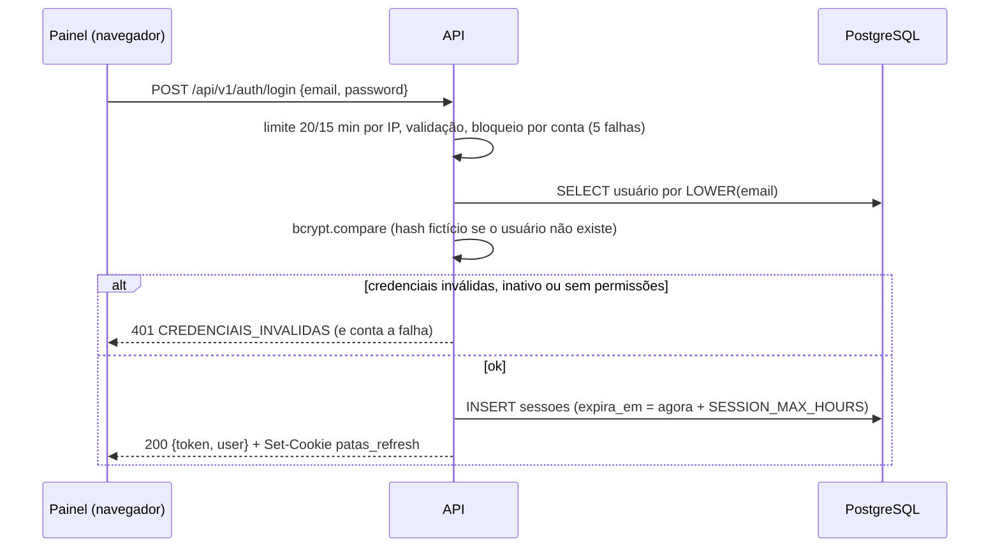
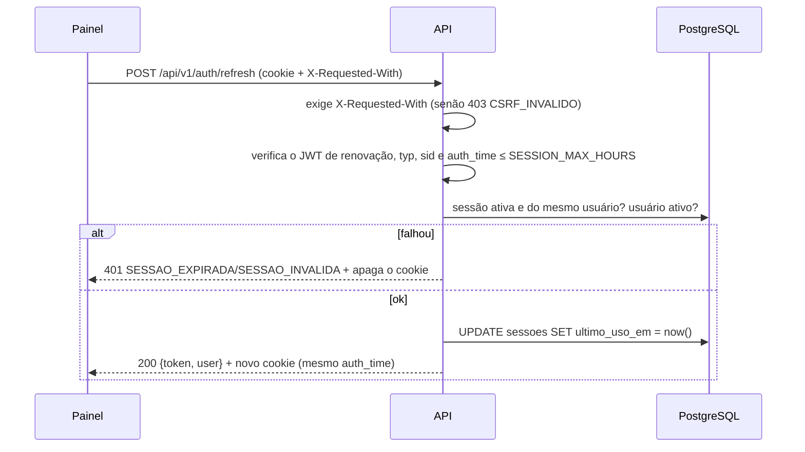

# 7. Autenticação e autorização

## Visão geral

- **Quem faz login:** só a equipe do painel (`usuarios`). O site público não tem login; adotantes, doadores e
  voluntários não têm conta.
- **Dois tokens + sessão no banco:**
  - *token de acesso* — JWT assinado com `JWT_SECRET`, vale `JWT_EXPIRES_IN` (15 min), enviado em `Authorization: Bearer`;
  - *token de renovação* — JWT assinado com `REFRESH_TOKEN_SECRET`, vale `SESSION_IDLE_MINUTES` (30 min) a partir do
    último uso, guardado no cookie `patas_refresh` (`HttpOnly`, `SameSite=Strict`, `Path=/api/v1/auth`, `Secure` em produção);
  - *sessão* — linha em `sessoes`, com limite absoluto de `SESSION_MAX_HOURS` (12 h). Os dois tokens carregam o id da
    sessão (`sid`); revogar a sessão derruba ambos na hora.
- **Autorização:** matriz única cargo × módulo × ação (`src/config/permissions.js`), aplicada em toda rota protegida por
  `requirePermission('modulo:acao')`. O cargo e a situação do usuário são lidos **do banco a cada requisição**.

## Fluxo de login

## Validação do token em cada requisição (`requireAuth`, `src/middleware/auth.js`)

1. Lê `Authorization: Bearer <token>`; sem ele → 401 `NAO_AUTENTICADO`.
2. `jwt.verify` com `JWT_SECRET`; assinatura inválida ou expirado → 401 `TOKEN_INVALIDO`.
3. Busca o usuário pelo `sub` (precisa ser UUID); inexistente, inativo ou cargo sem permissões → 401 `SESSAO_INVALIDA`.
4. Se o token tem `sid`, a sessão precisa estar ativa (não revogada, não expirada) e pertencer ao usuário → senão 401
   `SESSAO_INVALIDA`. ⚠️ Token **sem** `sid` pula essa verificação (o código atual sempre emite `sid`).
5. Preenche `req.user = { sub, email, nome, role, sid }` com os dados **do banco**, não do token.

`requirePermission(p)` então confere `hasPermission(req.user.role, p)`; sem permissão → 403 `SEM_PERMISSAO`.

## Renovação (refresh)

A renovação gira o cookie a cada uso; o limite absoluto (`auth_time`) não é renovado.

## Logout e revogação

- `POST /auth/logout` (com `X-Requested-With`) revoga a sessão do cookie e apaga o cookie; sempre conclui.
- Revogações automáticas:

| Evento | Sessões encerradas |
| --- | --- |
| Logout | A sessão do cookie |
| Troca da própria senha (`PATCH /me/password`) | Todas as outras do usuário (a atual continua) |
| Redefinição pelo link (`POST /auth/reset-password`) | Todas do usuário |
| Administrador define nova senha (`POST /users/:id/password`) | Todas do usuário |
| Usuário desativado (`PATCH /users/:id` com `ativo: false`) | Todas do usuário |

## Esqueci a senha e convite

- `POST /auth/forgot-password` responde sempre 202 e, em segundo plano, envia um link de **1 h** a usuários ativos.
- Convite (`POST /users` com `enviar_convite` ou `POST /users/:id/invite`): link de **72 h**.
- Os dois apontam para `<FRONTEND_URL>/admin/redefinir-senha?token=…` (o convite acrescenta `&convite=1`) e são
  consumidos por `POST /auth/reset-password`. Uso único; gerar um link invalida os anteriores; só o hash SHA-256 fica no
  banco (`tokens_redefinicao_acesso`). Sem SMTP, nenhum link é criado.

## Política de senha (`src/utils/password-policy.js`)

Pelo menos 10 caracteres, ao menos uma letra (`A–Z`, `a–z` ou acentuada `À–ÿ`) e um número, no máximo 72 bytes
(limite do bcrypt). Hash bcrypt com 12 rodadas. Aplicada no cadastro de membros, na redefinição pelo administrador,
na troca da própria senha, no link e no script `definir-senha`.

## Proteção contra força bruta

| Camada | Regra |
| --- | --- |
| Por IP | 20 tentativas de login a cada 15 min (`loginRateLimit`); 10 pedidos de link/redefinição a cada 15 min |
| Por conta | 5 falhas seguidas bloqueiam por 15 min, dobrando a cada bloqueio até 4 h (`login-throttle`, em memória) |
| Enumeração | Mesma resposta para e-mail inexistente e senha errada; comparação com hash fictício; "esqueci a senha" sempre 202 |

## Papéis e permissões

Cargos (`usuarios.cargo`) e rótulos (`roleLabels`):

| Cargo | Rótulo |
| --- | --- |
| `administrador` | Administrador (Super Admin) |
| `gestor_ong` | Gestor da ONG |
| `gestor_animais` | Gestor de animais (Veterinário/Cuidador) |
| `financeiro` | Financeiro (Atendimento e Doações) |
| `voluntariado` | Voluntariado (Voluntário) |

Matriz (fonte única: `src/config/permissions.js`; também gerada em `docs/permissoes.md`):

| Módulo | Ação | Administrador | Gestor da ONG | Gestor de animais | Financeiro | Voluntariado |
| --- | --- | :---: | :---: | :---: | :---: | :---: |
| `dashboard` | `read` | sim | sim | sim | sim | sim |
| `animals` | `read` | sim | sim | sim | — | sim |
| `animals` | `create` | sim | sim | sim | — | — |
| `animals` | `update` | sim | sim | sim | — | — |
| `animals` | `delete` | sim | sim | — | — | — |
| `animals` | `export` | sim | sim | sim | — | — |
| `adoptions` | `read` | sim | sim | sim | sim | — |
| `adoptions` | `update` | sim | sim | sim | sim | — |
| `adoptions` | `approve` | sim | sim | sim | — | — |
| `adopters` | `read` | sim | sim | sim | sim | — |
| `adopters` | `update` | sim | sim | — | sim | — |
| `adopters` | `reveal` | sim | sim | sim | sim | — |
| `adopters` | `export` | sim | sim | — | sim | — |
| `lgpd` | `approve` | sim | — | — | — | — |
| `donations` | `read` | sim | sim | — | sim | — |
| `donations` | `create` | sim | sim | — | sim | — |
| `donations` | `update` | sim | sim | — | sim | — |
| `donations` | `export` | sim | sim | — | sim | — |
| `volunteers` | `read` | sim | sim | sim | — | sim |
| `volunteers` | `create` | sim | sim | — | — | sim |
| `volunteers` | `update` | sim | sim | — | — | sim |
| `volunteers` | `delete` | sim | sim | — | — | — |
| `stories` | `read` | sim | sim | sim | — | sim |
| `stories` | `create` | sim | sim | sim | — | — |
| `stories` | `update` | sim | sim | sim | — | — |
| `stories` | `delete` | sim | sim | — | — | — |
| `team` | `read` | sim | — | — | — | — |
| `team` | `create` | sim | — | — | — | — |
| `team` | `update` | sim | — | — | — | — |

Qual permissão cada rota exige está no [índice de endpoints](04-endpoints/README.md#índice). Regras extras além da matriz:

| Regra | Onde |
| --- | --- |
| `em_processo → adotado` e `adotado → disponivel` só para `administrador`; cadastrar já `adotado` também | `animal-status-rules.js` |
| Ninguém altera o próprio cargo nem desativa a própria conta; sempre um administrador ativo | `user-service.update` |
| Responsável por pedido/agendamento precisa ser usuário ativo com `adoptions:update` | `adoption-triage-service` |
| Exportação de adotantes mostra contatos completos só para quem também tem `adopters:reveal` | `adopter-controller.exportCsv` |
| Revelar contatos de um pedido usa `adopters:reveal` (não `adoptions:*`) | `adoption-request-routes.js` |

`GET /api/v1/me` devolve a lista achatada `modulo:acao` do usuário (o painel monta menu e botões com ela) e
`GET /api/v1/permissions` devolve a matriz completa (`team:read`).
