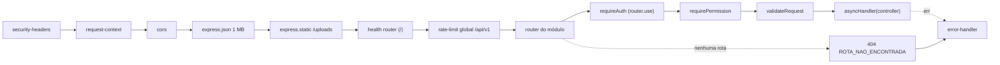

# 8. Middlewares

## Ordem de execução

Definida em `src/app.js`. Para uma requisição a `/api/v1/animals/:id` (exemplo), a cadeia é:

| Ordem | Middleware | Arquivo | Onde é aplicado |
| --- | --- | --- | --- |
| 0 | `app.disable('x-powered-by')` e `trust proxy` (se `TRUST_PROXY`) | `src/app.js` | Configuração do Express |
| 1 | `securityHeaders` | `src/middleware/security-headers.js` | Todas as respostas |
| 2 | `requestContext` | `src/middleware/request-context.js` | Todas |
| 3 | `cors({ origin: CORS_ORIGIN, credentials: true })` | pacote `cors` | Todas |
| 4 | `express.json({ limit: '1mb' })` | Express | Todas |
| 5 | `express.static(UPLOAD_DIR, { index: false, dotfiles: 'deny', immutable: true, maxAge: '365d' })` | Express | `/uploads` (troca o CORP para `cross-origin`) |
| 6 | Router de saúde | `modules/health/health-routes.js` | `/`, `/health`, `/ready` |
| 7 | `rateLimit({ windowMs: 5 min, max: 1000 })` | `src/middleware/rate-limit.js` | Tudo sob `/api/v1` |
| 8 | Routers dos módulos, nesta ordem: `public`, `auth` (montado em `/api/v1`), `dashboard`, `animals`, `adoption-requests`, `adopters`, `donations`, `volunteers`, `stories`, `users`, `permissions`, `webhooks` | `src/modules/*/…-routes.js` | Por prefixo |
| 8a | `requireAuth` via `router.use` | `src/middleware/auth.js` | Todas as rotas de animals, adoption-requests, adopters, donations, volunteers, stories, users |
| 8b | `requireAuth` por rota | idem | `/me`, `/me/password`, `/dashboard/summary`, `/permissions` |
| 8c | Limites específicos (`rateLimit`) | idem | Login (20/15 min), forgot/reset-password (10/15 min, compartilhado), formulários públicos (10/h, compartilhado) |
| 8d | `requireAjaxHeader` | `src/middleware/csrf.js` | `/auth/refresh`, `/auth/logout` |
| 8e | `requirePermission('modulo:acao')` | `src/middleware/auth.js` | Toda rota protegida (exceto `/me` e `/me/password`) |
| 8f | `validateRequest(validador)` | `src/middleware/validate-request.js` | Rotas com validador (algumas encadeiam dois: id + corpo) |
| 8g | `receivePhotos` | `src/middleware/upload.js` | `POST /animals/:id/photos` |
| 8h | `asyncHandler(controller)` | `src/middleware/async-handler.js` | Todos os handlers async |
| 9 | 404 (`ROTA_NAO_ENCONTRADA`) | `src/app.js` | Nenhuma rota correspondeu |
| 10 | `errorHandler` | `src/middleware/error-handler.js` | Qualquer erro encaminhado |

## Cada middleware

| Middleware | O que faz |
| --- | --- |
| `securityHeaders` | `X-Content-Type-Options: nosniff`, `X-Frame-Options: DENY`, `Referrer-Policy: no-referrer`, `Content-Security-Policy: default-src 'none'; frame-ancestors 'none'; base-uri 'none'`, `Cross-Origin-Resource-Policy: same-site` (o `/uploads` troca para `cross-origin`); `Cache-Control: no-store` em `/api/*`; `Strict-Transport-Security: max-age=31536000; includeSubDomains` quando a requisição é HTTPS (`req.secure`) |
| `requestContext` | Gera um UUID por requisição (`req.requestId`), devolve em `X-Request-Id` e, ao terminar, registra `http_request` com método, status e duração (ms) |
| `cors` | Aceita só as origens de `CORS_ORIGIN`, com credenciais (cookie) |
| `express.json` | Lê JSON até 1 MB; JSON inválido → 400 `JSON_INVALIDO`; acima do limite → 400 `CORPO_MUITO_GRANDE` |
| `rateLimit({ windowMs, max, keyFn })` | Janela fixa por chave (padrão `req.ip`), **em memória**; envia `RateLimit-Limit`/`RateLimit-Remaining`; acima do limite → 429 `MUITAS_REQUISICOES` com `Retry-After`. Limpa as janelas vencidas uma vez por janela. Cada chamada da fábrica cria um contador independente; rotas que usam a mesma instância somam o limite |
| `requireAuth` | Ver [7. Autenticação](07-autenticacao-autorizacao.md#validação-do-token-em-cada-requisição-requireauth-srcmiddlewareauthjs) |
| `requirePermission(p)` | Sem `req.user` → 401 `NAO_AUTENTICADO`; cargo sem `p` → 403 `SEM_PERMISSAO` |
| `requireAjaxHeader` | Exige `X-Requested-With: XMLHttpRequest`, senão 403 `CSRF_INVALIDO`. Formulários de outros sites não conseguem enviar esse cabeçalho sem passar pelo CORS; somado ao `SameSite=Strict`, bloqueia CSRF nas rotas do cookie |
| `validateRequest(v)` | Chama `v({ body, params, query })`; lista não vazia → 422 `VALIDACAO_INVALIDA` com `details` |
| `receivePhotos` | `multer` em memória, campo `fotos`, até 10 arquivos de 5 MB; erros do multer → 422 `ARQUIVO_INVALIDO` com mensagem em português |
| `asyncHandler(h)` | Encaminha a promessa rejeitada para `next(error)`. O único handler sem ele é `GET /permissions` (`permissionMatrix`, síncrono) |
| `errorHandler` | Se a resposta já começou, repassa ao Express. Converte `AppError` na resposta; `entity.parse.failed` → 400 `JSON_INVALIDO`; `entity.too.large` → 400 `CORPO_MUITO_GRANDE`; qualquer outro → 500 `ERRO_INTERNO` (sem detalhes). Registra `request_failed` com `requestId`, método, status e código — **para qualquer erro, inclusive 4xx**; a mensagem e a pilha do erro original não são registradas |

Rotas sem nenhum middleware próprio além do `asyncHandler` (só os globais): `GET /public/adoption-steps`,
`GET /public/stats`, `GET /public/donations/status/:ref` e `POST /webhooks/mercadopago` (a autenticidade do webhook
vem da assinatura, conferida no service).
