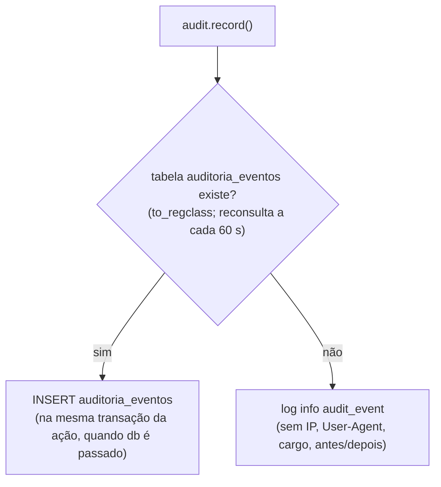

# 12. Logs, monitoramento e auditoria

## Logger (`src/utils/logger.js`)

- Escreve **uma linha JSON por evento no `stdout`**: `{ timestamp, level, event, ...contexto }`. Não grava arquivo,
  não envia a serviço externo e não tem níveis além de `info` e `error`.
- **Lista fechada de campos** (LGPD): só entram `requestId`, `method`, `statusCode`, `durationMs`, `code`, `userId`,
  `action`, `module`, `entity`, `entityId`, `port` e `signal`, e só com valor texto ou número. Qualquer outro campo
  (e-mail, nome, corpo da requisição, mensagem de erro, pilha) é descartado.
- Consequência: o log **não registra a mensagem nem a pilha** de erros inesperados (500); só o código. Para investigar
  um 500 é preciso reproduzir o problema. ⚠️ A confirmar se isso é intencional para todos os casos.

Exemplo:

```json
{"timestamp":"2026-10-07T13:00:00.000Z","level":"info","event":"http_request","requestId":"5f0c…","method":"GET","statusCode":200,"durationMs":12.34}
```

## Eventos registrados

| Nível | Evento | Quando | Campos | Onde |
| --- | --- | --- | --- | --- |
| info | `api_started` | Servidor escutando | `port` | `server.js` |
| info | `http_request` | Fim de toda requisição | `requestId`, `method`, `statusCode`, `durationMs` | `middleware/request-context.js` |
| info | `shutdown_started` | `SIGTERM`/`SIGINT` | `signal` | `server.js` |
| info | `audit_event` | Ação auditável quando a tabela `auditoria_eventos` não existe | `userId`, `action`, `module`, `entity`, `entityId` | `modules/audit/audit-service.js` |
| error | `request_failed` | Qualquer erro tratado pelo `errorHandler` (4xx e 5xx) | `requestId`, `method`, `statusCode`, `code` | `middleware/error-handler.js` |
| error | `database_pool_error` | Erro numa conexão ociosa do pool | `code` | `db/pool.js` |
| error | `database_pool_close_failed` | Falha ao fechar o pool no encerramento | — | `server.js` |
| error | `http_server_close_failed` | Falha ao fechar o servidor HTTP | — | `server.js` |
| error | `shutdown_forced` | Encerramento passou de 8 s | — | `server.js` |
| error | `mercadopago_sem_resposta` | Rede/timeout ao chamar o MP | `module`, `code` (nome do erro) | `integrations/payments/mercado-pago-client.js` |
| error | `mercadopago_erro` | MP respondeu não-2xx | `module`, `statusCode`, `code` | idem |
| error | `email_acesso_falhou` | SMTP falhou no convite/redefinição | `module`, `entityId`, `code` | `modules/auth/access-link-service.js` |
| error | `email_redefinicao_nao_enviado` | "Esqueci a senha" não enviou (ex.: SMTP ausente ou recusou) | `module`, `entityId` | `modules/auth/auth-service.js` |
| error | `email_redefinicao_falhou` | Exceção no envio em segundo plano | `module`, `entityId`, `code` | idem |
| error | `email_adotante_falhou` | SMTP falhou num e-mail ao adotante | `module`, `entityId`, `code` | `modules/adoptions/adoption-triage-service.js` |
| error | `historico_email_falhou` | Falha ao anotar o resultado do e-mail no histórico | `module`, `entityId`, `code` | idem |
| error | `email_assinatura_falhou` | SMTP falhou no e-mail de assinatura ativa | `module`, `code` | `modules/donations/online-donation-service.js` |
| error | `email_link_cancelamento_falhou` | SMTP falhou no link de cancelamento | `module`, `code` | idem |

Total: 4 eventos `info` e 14 `error`.

Correlação: o `requestId` volta ao cliente no cabeçalho `X-Request-Id` e aparece em `http_request` e
`request_failed`. Os eventos de serviços (e-mail, Mercado Pago) não levam o `requestId`.

## Monitoramento

| Recurso | O que oferece |
| --- | --- |
| `GET /health` | Processo vivo (não consulta o banco); usado pelo `HEALTHCHECK` do Docker a cada 30 s |
| `GET /ready` | Banco acessível (`SELECT 1`, até 3 tentativas); 503 quando não |
| `X-Request-Id` | Liga a resposta recebida pelo cliente às linhas `http_request`/`request_failed` |
| `durationMs` em `http_request` | Tempo de cada requisição, para medir lentidão a partir dos logs |

Não há métricas (Prometheus etc.), APM, rastreamento distribuído nem alertas configurados no repositório. ⚠️ A
confirmar se a plataforma de hospedagem coleta o `stdout` e alerta sobre os eventos `error`.

## Auditoria

Ações sensíveis passam por `audit.record(evento, db?)` (`src/modules/audit/audit-service.js`). O evento leva autor
(`userId`, cargo, IP, `User-Agent` até 500 caracteres — extraídos de `req` por `auditContext`), ação, módulo, entidade,
id da entidade e, quando o chamador informa, valores `before`/`after`.

**Onde é gravado:**



A tabela `auditoria_eventos` vem da migration **001, que ainda não foi aplicada** (ver
[5. Banco de dados](05-banco-de-dados.md)). Hoje, portanto, a auditoria vai **só para o log**, e o log guarda apenas
usuário, ação, módulo, entidade e id. Aplicar a 001 ativa a gravação no banco sem reiniciar a API (a disponibilidade é
reconsultada a cada minuto). Quando a gravação acontece dentro da transação da ação, uma falha no `INSERT` desfaz
também a ação.

### Ações auditadas (30)

| Módulo (`module`) | Ações | Origem |
| --- | --- | --- |
| `animals` | `criar`, `editar`, `alterar_status`, `excluir`, `adicionar_fotos`, `definir_foto_principal`, `remover_foto` | `animal-service` |
| `adoptions` | `editar`, `mover_pedido`, `revelar_dados_pedido`, `aprovar`, `reprovar`, `reprovar_automaticamente`, `agendar`, `remarcar_agendamento`, `cancelar_agendamento`, `concluir_agendamento`, `marcar_termo_assinado` | `adoption-triage-service` |
| `adopters` | `editar`, `revelar_contato`, `exportar`, `exportar_com_contatos` | `adopter-service` |
| `lgpd` | `lgpd_exportar`, `lgpd_anonimizar`, `lgpd_excluir` | `adopter-service` |
| `donations` | `criar`, `editar`, `alterar_status`, `exportar`, `cancelar_assinatura` | `donation-service`, `online-donation-service` |
| `volunteers` | `criar`, `editar`, `excluir`, `inscricao_publica` | `volunteer-service` |
| `stories` | `criar`, `editar`, `publicar`, `despublicar`, `excluir` | `story-service` |
| `team` | `criar`, `editar`, `enviar_convite`, `redefinir_senha`, `alterar_propria_senha` | `user-service`, `auth-controller` |

São 38 chamadas a `audit.record` no código.

**Não auditado:** login, logout e renovação; exportação CSV de **animais** (`GET /animals/export`); criação de pedido
de adoção pelo site (`POST /public/adoption-requests`); doação online e webhooks (exceto o cancelamento pelo painel);
cancelamento de assinatura pelo link público; leituras em geral (exceto as revelações de contato). ⚠️ A confirmar se
alguma dessas deveria ser auditada.
