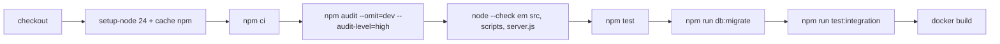

# 15. Deploy

⚠️ A confirmar: o repositório **não diz onde a API está hospedada** em produção (não há arquivo de configuração de
plataforma — Render, Railway, Fly, Heroku etc. — nem passo de deploy no CI). O que existe é a imagem Docker, o CI e o
banco no Neon (pela `DATABASE_URL` de exemplo e pelos comentários do código).

## Integração contínua (`.github/workflows/backend-ci.yml`)

Roda em **todo push e pull request**, em `ubuntu-latest`, com um serviço `postgres:16` (usuário/senha `patas`, banco
`patas_teste`) e `NODE_ENV=test`.



| Etapa | Falha quando |
| --- | --- |
| Auditoria de dependências | Vulnerabilidade alta/crítica em dependência de produção |
| Verificação de sintaxe | Algum `.js` não compila |
| Testes unitários e HTTP | Qualquer um dos 109 testes falha |
| Migrations no banco de teste | Alguma migration de `ordem.json` falha num banco vazio |
| Testes de integração | Algum dos 14 fluxos falha no PostgreSQL 16 |
| Imagem Docker | O `Dockerfile` não constrói |

O CI **não publica** a imagem nem faz deploy.

## Imagem Docker (`Dockerfile`)

| Item | Valor |
| --- | --- |
| Base | `node:24-alpine`, dois estágios (dependências com `npm ci --omit=dev`, depois a imagem final) |
| Conteúdo | `node_modules`, `package.json`, `server.js`, `src/`, `scripts/` |
| Fora da imagem (`.dockerignore`) | `.env*` (menos `.env.example`), `.git`, `.github`, `tests`, `docs`, **`migrations`**, `README.md`, `node_modules` local |
| Ambiente | `NODE_ENV=production` |
| Usuário | `node` (sem root) |
| Porta | `EXPOSE 4000` |
| Volume | `/app/uploads` (fotos enviadas) |
| Healthcheck | A cada 30 s, `GET /health` local; 3 falhas seguidas marcam o contêiner como não saudável |
| Comando | `node server.js` (sem `npm`, para o `SIGTERM` chegar ao processo) |

```bash
docker build -t patas-em-casa-api .
docker run --env-file .env -p 4000:4000 -v patas-uploads:/app/uploads patas-em-casa-api
```

⚠️ A confirmar: como a pasta `migrations/` não entra na imagem, `npm run db:migrate` **não funciona dentro do
contêiner** (o script `scripts/migrar.js` está lá, mas não acha `migrations/ordem.json`). As migrations precisam ser
aplicadas de fora (máquina local ou CI) antes de subir a nova versão.

## Variáveis obrigatórias em produção

A API não sobe sem `DATABASE_URL`, `JWT_SECRET` (32+), `REFRESH_TOKEN_SECRET` (32+, diferente), `CORS_ORIGIN` e
`API_PUBLIC_URL`. Opcionais: SMTP, Mercado Pago, `TRUST_PROXY` (necessária atrás de proxy/balanceador), `UPLOAD_DIR`,
`REQUEST_TIMEOUT_MS`, `SESSION_*`, `FRONTEND_URL`. Lista completa em
[2. Como rodar](02-como-rodar.md#variáveis-de-ambiente).

## Banco de dados

- PostgreSQL gerenciado no **Neon**. A API usa `DATABASE_URL_DIRECT` (conexão direta) se existir, senão
  `DATABASE_URL`. ⚠️ A confirmar qual das duas é usada em produção (o README e o código divergem — ver
  [16](16-pontos-de-atencao.md)).
- Migrations: `npm run db:migrate` aplica, em ordem e cada uma numa transação, as listadas em
  `migrations/ordem.json`, registrando nome e checksum SHA-256 em `schema_migrations`. Arquivo já aplicado que mudou →
  erro. `--status` lista aplicadas/pendentes; `--baseline <arquivo>` marca como aplicada sem executar (para bancos
  criados antes do controle).
- Rollbacks em `migrations/rollback/` são manuais (não há comando).

## Passo a passo de uma publicação (o que o código exige)

1. CI verde no commit.
2. Aplicar migrations pendentes no banco de produção: `npm run db:migrate` (de fora do contêiner).
3. Construir e subir a imagem com as variáveis de produção e um volume persistente em `/app/uploads`.
4. Conferir `GET /health` (processo) e `GET /ready` (banco).
5. Configurar no Mercado Pago a URL de notificação `<API_PUBLIC_URL>/api/v1/webhooks/mercadopago` e a assinatura
   secreta igual a `MERCADOPAGO_WEBHOOK_SECRET` (a URL também é enviada em cada preferência de pagamento).

## Encerramento e reinício

No `SIGTERM`/`SIGINT` a API para de aceitar conexões, espera até 5 s pelas requisições em andamento, fecha o pool do
banco e sai; se passar de 8 s, sai à força com código 1. Estado em memória (rate limit, bloqueio de login, cache do
painel) é perdido no reinício (ver [11. Jobs](11-jobs.md)).

## Escala

Com mais de uma instância, rate limit, bloqueio de login e cache do painel deixam de ser globais (cada instância tem
os seus), e as fotos precisam estar num volume compartilhado. O código não traz configuração para isso.
