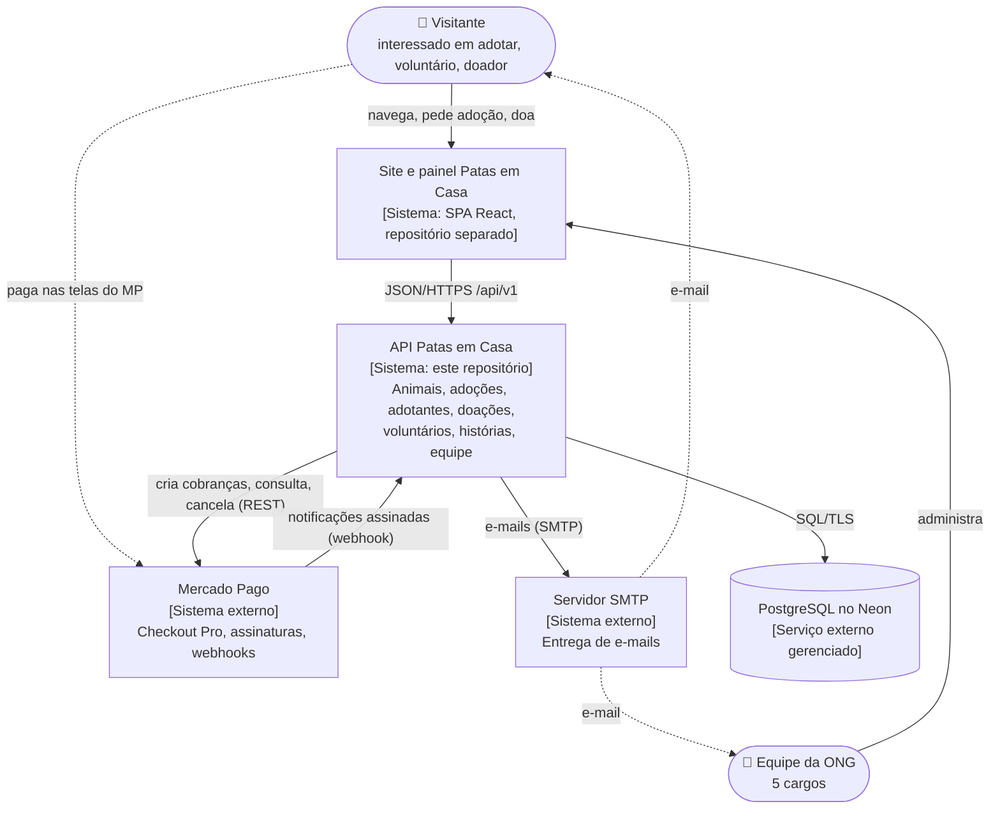
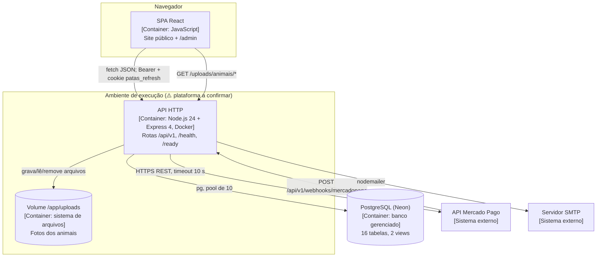
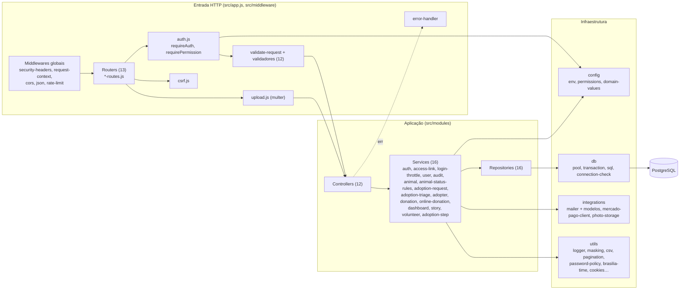
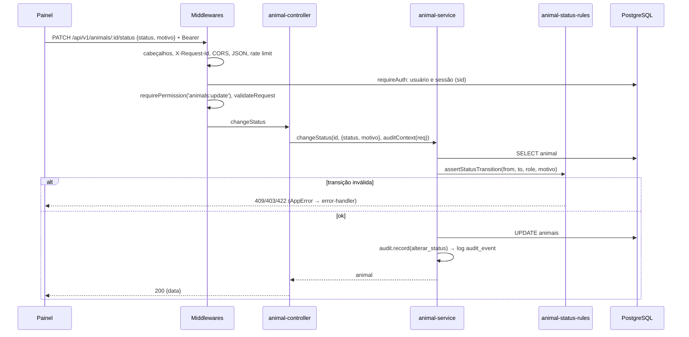
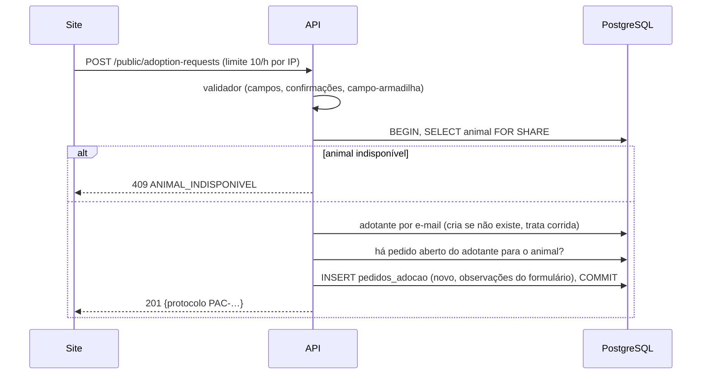
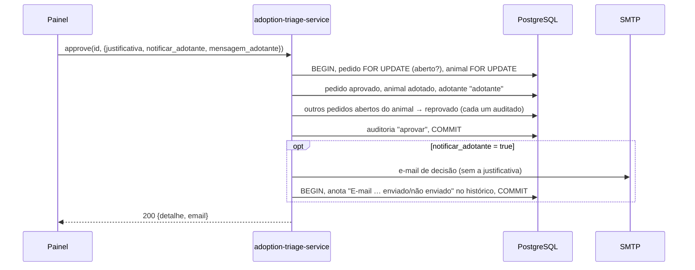
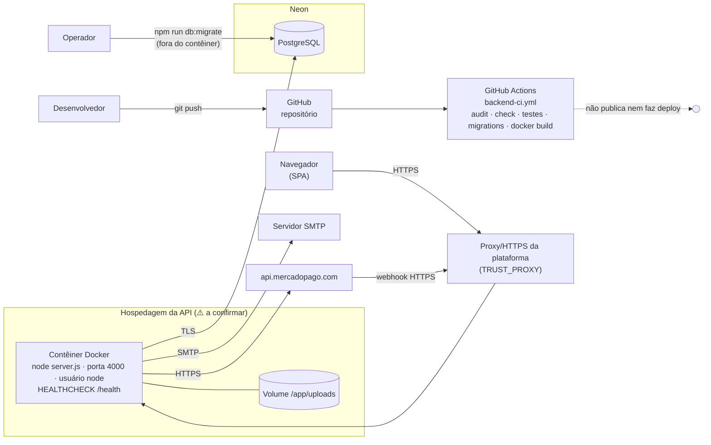

# Arquitetura

## 1. Estilo arquitetural

**Monólito modular em camadas**, uma API HTTP JSON stateless (com exceções em memória, ver §8):

```text
HTTP → middlewares globais → router do módulo → [auth, permissão, validação] → controller → service → repository → PostgreSQL
                                                                                  └→ integrações (SMTP, Mercado Pago, disco)
```

- **Módulos por domínio** em `src/modules/<domínio>/` (14 domínios), cada um com `routes`, `controller`,
  `validator(s)`, `service`, `repository`. Detalhes em [3. Estrutura](../03-estrutura.md).
- **Services por fábrica** (`createXService(deps)`): regras de negócio sem dependência de HTTP; dependências
  injetáveis para teste.
- **Repositories** com SQL puro e parâmetros; aceitam o cliente da transação do chamador.
- **Infraestrutura compartilhada**: `src/config` (ambiente, permissões, valores de domínio), `src/db` (pool,
  transação), `src/middleware`, `src/integrations`, `src/utils`.

Os diagramas C4 abaixo usam `flowchart` do Mermaid com a notação do C4 (pessoa, sistema, container, componente).

## 2. C4 — Nível 1: Contexto



## 3. C4 — Nível 2: Containers



## 4. C4 — Nível 3: Componentes da API



## 5. Sequências

### 5.1 Requisição autenticada típica (mudar status de um animal)



### 5.2 Pedido de adoção pelo site



### 5.3 Aprovação com e-mail ao adotante



Login e renovação: [7. Autenticação](../07-autenticacao-autorizacao.md). Doação online e webhook:
[10. Integrações](../10-integracoes.md#mercado-pago).

## 6. Decisões arquiteturais

Registradas a partir do código e dos comentários. "Fonte" indica onde a decisão aparece.

| # | Decisão | Motivo (como aparece no código) | Consequência | Fonte |
| --- | --- | --- | --- | --- |
| DA01 | SQL puro com `pg`, sem ORM | ⚠️ inferido, confirmar (sem comentário explícito) | Controle total do SQL e dos bloqueios; mapeamento e montagem de `UPDATE` feitos à mão (`db/sql.js`) | `package.json`, repositories |
| DA02 | Módulos por domínio e services por fábrica com injeção | ⚠️ inferido, confirmar (os testes injetam repositórios, e-mail, gateway e relógio falsos) | 109 testes unitários rápidos; cada módulo exporta instância padrão + fábrica | `src/modules/*`, `tests/unit` |
| DA03 | JWT de 15 min no cabeçalho + cookie `HttpOnly` de renovação + sessão no banco | "revogar a sessão no banco derruba ambos" (os dois tokens levam o `sid`); limite por inatividade e por tempo total | Cada requisição consulta usuário e sessão no banco | `middleware/auth.js`, `auth-service`, migration 010 |
| DA04 | Matriz de permissões única em código | "Matriz única de permissões"; `/me` devolve a lista "para o frontend montar menu, rotas e botões" | Mudar permissão exige deploy; `docs/permissoes.md` é gerado e conferido por teste | `config/permissions.js`, `shared.test.js` |
| DA05 | Contrato estável: `/api/v1`, envelopes `{data, meta}`/`{error}`, códigos fixos, OpenAPI verificado | ⚠️ inferido, confirmar (códigos em maiúsculas, estáveis, e teste que compara rotas e OpenAPI) | Toda rota nova precisa entrar no `openapi.yaml` (teste falha) | `utils/http-response.js`, `openapi-coverage.test.js` |
| DA06 | E-mail sempre depois de gravar; nunca condição | "o e-mail nunca é condição para salvar a ação no banco" | Ações valem mesmo com SMTP fora; resultado anotado no histórico | `mailer.js`, `notifyAdopter` |
| DA07 | Webhook: verificar assinatura, registrar o evento e consultar o MP; nunca usar o corpo | "o corpo da notificação nunca é usado como fonte da verdade" | Segurança contra notificação forjada; custo de uma chamada extra; evento com falha não é reprocessado (risco R2) | `online-donation-service.handleWebhook` |
| DA08 | Cartão nunca passa pela API (Checkout Pro / preapproval) | "dados de cartão nunca passam pela API da ONG" | Sem escopo PCI na API; o doador sai do site para pagar | `startCheckout` |
| DA09 | Fotos no disco local, servidas pela própria API | ⚠️ inferido, confirmar (sem armazenamento de objetos configurado) | Simples; exige volume persistente e impede várias instâncias sem disco compartilhado | `photo-storage.js`, `Dockerfile` |
| DA10 | Limites, bloqueio de login e cache em memória | "em memória (uma instância da API)" | Sem dependência externa (Redis); não escala horizontalmente | `rate-limit.js`, `login-throttle.js` |
| DA11 | Logs JSON no stdout com lista fechada de campos | "nenhum dado pessoal (LGPD)" | Logs seguros para LGPD; diagnóstico de erros 500 limitado | `utils/logger.js` |
| DA12 | Migrations por script próprio com checksum; propostas fora de `ordem.json` | Aplicar só o aprovado e impedir edição de migration aplicada | Rollback manual; propostas 001–008 ficam no repositório sem efeito | `scripts/migrar.js`, `migrations/ordem.json` |
| DA13 | Dados pessoais mascarados por padrão, revelação explícita e auditada | LGPD | Telas mostram `ma***@…`; revelar é uma ação própria com permissão | `utils/masking.js`, rotas `reveal` |
| DA14 | Datas `DATE` como texto e agendamentos em UTC-3 fixo | Não deslocar o dia pelo fuso; "O Brasil não tem horário de verão desde 2019" | Correto hoje; quebra se o horário de verão voltar | `db/pool.js`, `brasilia-time.js` |
| DA15 | Testes com `node:test` e integração em transação desfeita | Rodar no banco real sem deixar dados | Integração exige `DATABASE_URL`; CI sobe PostgreSQL 16 | `tests/helpers/db-transaction.js`, CI |

## 7. Tecnologias

| Camada | Tecnologia | Versão | Papel |
| --- | --- | --- | --- |
| Runtime | Node.js | `>=20` (Docker e CI: 24) | Execução |
| HTTP | Express | `^4.21.2` | Rotas e middlewares |
| Banco | PostgreSQL (Neon) + `pg` | `pg ^8.17.0`; servidor ⚠️ a confirmar (CI: 16) | Persistência |
| Autenticação | `jsonwebtoken`, `bcryptjs` | `^9.0.2`, `^3.0.0` | Tokens e hash de senha |
| Upload | `multer` | `^2.4.0` | Multipart em memória |
| E-mail | `nodemailer` | `^10.0.15` | SMTP |
| Pagamentos | Mercado Pago REST via `fetch` | — | Checkout Pro, assinaturas |
| Configuração | `dotenv`, `cors` | `^16.4.5`, `^2.8.5` | `.env`, CORS |
| Testes | `node:test` | nativo | Unitários, HTTP, integração |
| Empacotamento | Docker `node:24-alpine` | — | Imagem de produção |
| CI | GitHub Actions | — | Auditoria, testes, migrations, build |

## 8. Atendimento aos requisitos não funcionais

| RNF | Mecanismo | Avaliação |
| --- | --- | --- |
| RNF01–RNF03 Segurança de acesso | DA03, DA04, bcrypt 12, política de senha | Atendido |
| RNF04 Abuso e força bruta | Rate limit por IP + bloqueio por conta (DA10) | Parcial: perde estado no reinício e não soma entre instâncias |
| RNF05–RNF06 Superfície HTTP e entrada | Cabeçalhos, CORS, CSRF, validadores, SQL parametrizado, upload pelo conteúdo | Atendido |
| RNF07 LGPD | DA11, DA13, direitos do titular | Parcial: voluntários/assinaturas sem máscara; consentimento não registrado |
| RNF08 Rastreabilidade | `audit-service` | Parcial: sem a migration 001, só o log |
| RNF09 Integridade | `withTransaction`, `FOR UPDATE`/`FOR SHARE` na triagem, pedidos e LGPD | Parcial: fotos e várias edições sem transação |
| RNF10 Idempotência | `X-Idempotency-Key`, tabela de eventos, índice único | Parcial: evento com falha não é reprocessado |
| RNF11–RNF12 Desempenho | Paginação (máx. 100), cache de 15 s, timeouts, consultas do painel em paralelo | Atendido para uma instância; sem testes de carga |
| RNF13–RNF14 Disponibilidade | `/health`, `/ready`, encerramento gracioso, degradação sem SMTP/MP | Atendido |
| RNF15 Observabilidade | Logs JSON + `X-Request-Id` | Parcial: sem pilha de erro nem métricas |
| RNF16 Interoperabilidade | DA05 | Atendido |
| RNF17 Manutenibilidade | DA02, testes, CI | Parcial: sem linter, duplicações |
| RNF18 Portabilidade | `env.js` validado, Docker | Atendido |
| RNF20 Escalabilidade | — | Não atendido hoje (DA09, DA10) |

## 9. Implantação



Passo a passo e requisitos de cada peça em [15. Deploy](../15-deploy.md).

## 10. Riscos arquiteturais

| # | Risco | Probabilidade | Impacto | Origem | Mitigação possível (não implementada) |
| --- | --- | --- | --- | --- | --- |
| R1 | Vazamento do banco pela senha no histórico público | Alta | Crítico | C1 em [16](../16-pontos-de-atencao.md) | Trocar a senha, privar o repositório, limpar o histórico |
| R2 | Pagamento confirmado que fica `pendente` | Média | Alto | DA07, A1 | Permitir reprocessar eventos `falhou`; conciliação periódica com o MP |
| R3 | Perda das fotos ao recriar o contêiner | Média | Alto | DA09 | Volume persistente garantido ou armazenamento de objetos |
| R4 | Sem trilha de auditoria consultável | Alta (hoje) | Médio | A2 | Aplicar a migration 001 |
| R5 | Limites inefetivos com várias instâncias | Baixa (uma instância hoje) | Médio | DA10 | Armazenamento compartilhado (ex.: banco ou Redis) |
| R6 | Inconsistência em operações sem transação | Baixa | Médio | M4 | Envolver fotos e edições em `withTransaction` |
| R7 | Diagnóstico lento de erros em produção | Média | Médio | DA11, M8 | Registrar o nome/código do erro original sem dados pessoais |
| R8 | Crescimento contínuo de sessões, tokens e eventos | Certa (lenta) | Baixo | M11 | Limpeza periódica |
| R9 | Mudança de fuso (horário de verão) | Baixa | Médio | DA14 | Usar `America/Sao_Paulo` em vez de `-03:00` fixo |
