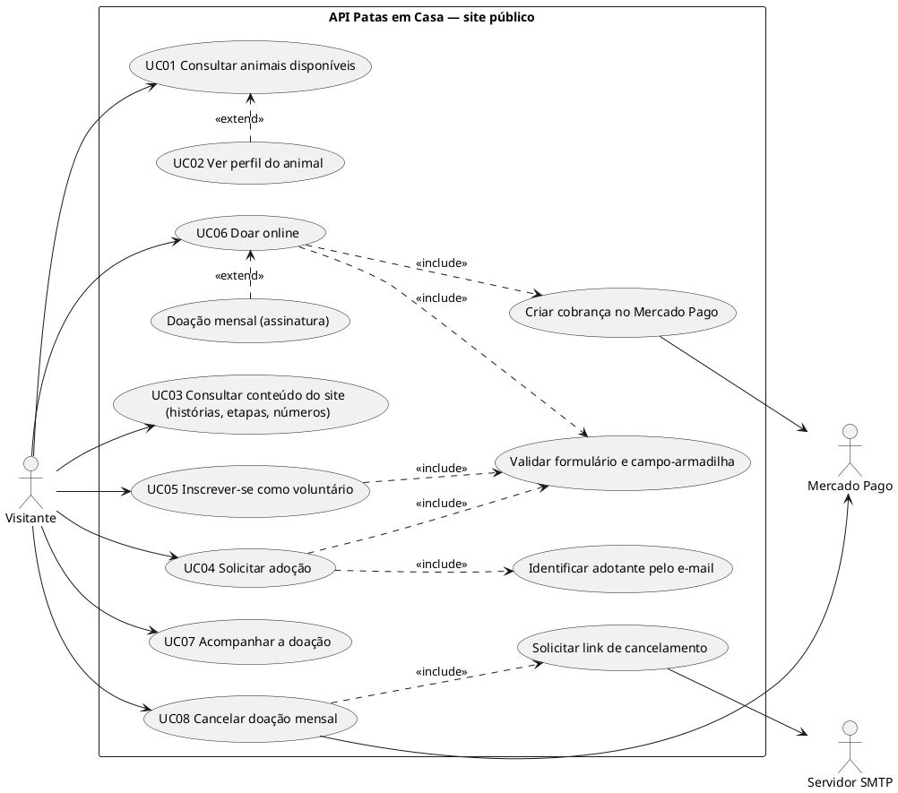
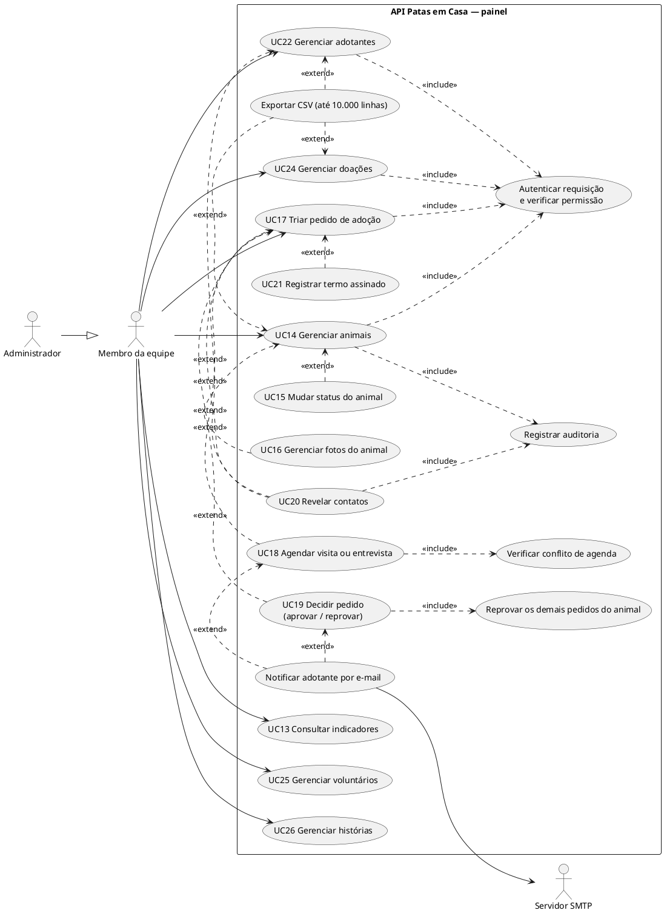
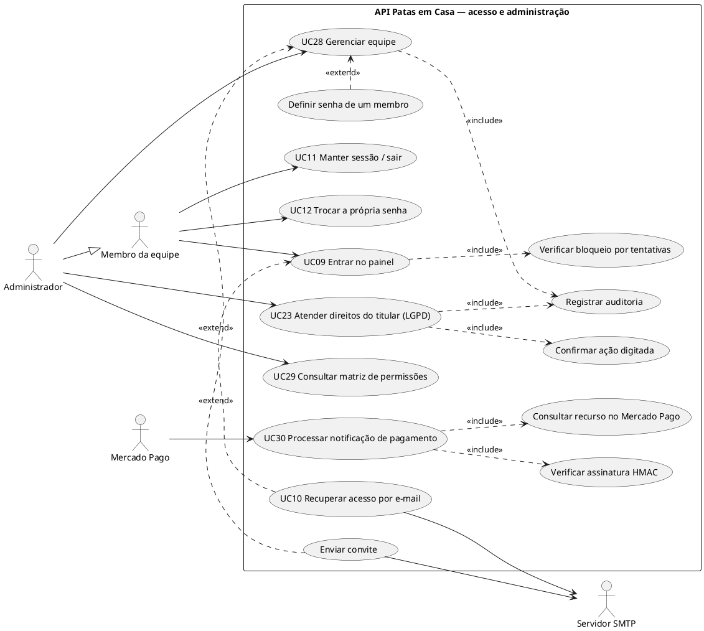

# Casos de uso

Derivados das rotas e regras existentes. Requisitos (RF) e regras (RN) em [requisitos.md](requisitos.md).

## Atores

| Ator | Tipo | Descrição |
| --- | --- | --- |
| Visitante | Primário, humano | Pessoa no site público, sem login (interessado em adotar, voluntário, doador) |
| Membro da equipe | Primário, humano | Usuário do painel; o que pode fazer depende do cargo (`gestor_ong`, `gestor_animais`, `financeiro`, `voluntariado`) — ver a matriz em [7. Autenticação](../07-autenticacao-autorizacao.md#papéis-e-permissões) |
| Administrador | Primário, humano | Especialização de Membro com todas as permissões, incluindo equipe e LGPD |
| Mercado Pago | Secundário/primário, sistema | Processa pagamentos e envia notificações (webhooks) |
| Servidor SMTP | Secundário, sistema | Entrega os e-mails |

## Diagramas

### Site público

### Painel — operação

### Acesso, administração e integrações

**Notas sobre os diagramas.** "Autenticar requisição e verificar permissão" é incluído por **todos** os casos do
painel (o diagrama mostra só alguns vínculos para não poluir). "Registrar auditoria" é incluído por todas as escritas
listadas em [12. Logs](../12-logs.md#ações-auditadas-30). A permissão exigida em cada caso vem da matriz; o cargo
`voluntariado`, por exemplo, só lê animais e histórias e gerencia voluntários.

## Especificações

Formato: ator · pré-condições · fluxo principal · alternativas e exceções (código de erro) · pós-condições · regras ·
endpoints. Erros comuns do painel (401 `NAO_AUTENTICADO`/`TOKEN_INVALIDO`/`SESSAO_INVALIDA`, 403 `SEM_PERMISSAO`,
422 `VALIDACAO_INVALIDA`, 429 `MUITAS_REQUISICOES`) valem para todos e não são repetidos.

### UC01 — Consultar animais disponíveis
- **Ator:** Visitante. **Pré-condições:** nenhuma.
- **Fluxo principal:** 1. O visitante filtra (espécie, porte, sexo, busca) e pagina. 2. A API devolve só animais `disponivel`/`urgente`, com a foto principal.
- **Alternativas:** filtro inválido → 422.
- **Regras:** RN01. **Endpoint:** `GET /public/animals`.

### UC02 — Ver perfil do animal *(estende UC01)*
- **Ator:** Visitante. **Pré-condições:** id do animal.
- **Fluxo principal:** 1. O visitante abre o perfil. 2. A API devolve dados públicos, galeria e temperamento.
- **Alternativas:** animal adotado ou em processo → 410 `ANIMAL_INDISPONIVEL` com aviso; inativo/inexistente → 404 `ANIMAL_NAO_ENCONTRADO`.
- **Regras:** RN01, RN08. **Endpoint:** `GET /public/animals/:id`.

### UC03 — Consultar conteúdo do site
- **Ator:** Visitante.
- **Fluxo principal:** a API devolve histórias publicadas (paginadas, sem dados do adotante), etapas ativas da adoção ou números agregados.
- **Regras:** RN40. **Endpoints:** `GET /public/stories`, `/public/adoption-steps`, `/public/stats`.

### UC04 — Solicitar adoção
- **Ator:** Visitante. **Pré-condições:** animal `disponivel`/`urgente`.
- **Fluxo principal:** 1. O visitante preenche o formulário (dados pessoais, moradia, rotina, confirmações, visita preferida opcional). 2. *Include* validação e campo-armadilha. 3. *Include* identificação do adotante pelo e-mail (cria se não existe; não sobrescreve se existe). 4. A API grava o pedido `novo` com os dados no histórico. 5. Devolve 201 com o protocolo `PAC-…`.
- **Alternativas:** animal inexistente → 404; indisponível → 409 `ANIMAL_INDISPONIVEL`; pedido aberto do mesmo e-mail para o animal → 409 `PEDIDO_EM_ANDAMENTO`; visita preferida no passado → 422 `DATA_NO_PASSADO`; confirmações ausentes ou armadilha preenchida → 422; mais de 10 envios/h do IP → 429.
- **Pós-condições:** pedido `novo`; animal **não** muda de status.
- **Regras:** RN10–RN14. **Endpoint:** `POST /public/adoption-requests`.

### UC05 — Inscrever-se como voluntário
- **Ator:** Visitante.
- **Fluxo principal:** 1. Envia nome, e-mail, telefone, áreas. 2. A API cria o voluntário `inativo` com as áreas numa transação. 3. Devolve o protocolo `VOL-…`.
- **Alternativas:** e-mail já cadastrado → devolve o mesmo protocolo sem alterar nada; armadilha preenchida → 422.
- **Regras:** RN39. **Endpoint:** `POST /public/volunteers`.

### UC06 — Doar online
- **Atores:** Visitante, Mercado Pago.
- **Fluxo principal (única):** 1. O visitante informa valor, nome, e-mail e `tipo: unica`. 2. A API grava a doação `pendente`. 3. *Include* cria a preferência de Checkout Pro no MP. 4. Devolve 201 com `referencia` e `checkout_url`. 5. O visitante paga nas telas do MP.
- **Extensão — doação mensal:** com `tipo: recorrente`, grava `assinaturas_doacao` `pendente` e cria um *preapproval* mensal.
- **Alternativas:** MP não configurado → 503 `PAGAMENTO_INDISPONIVEL`; MP fora do ar → 502 `GATEWAY_INDISPONIVEL` (o registro `pendente` fica); valor fora de R$ 5–10.000 → 422.
- **Regras:** RN35. **Endpoint:** `POST /public/donations/checkout`.

### UC07 — Acompanhar a doação
- **Ator:** Visitante. **Fluxo:** a página de retorno consulta a referência; a API devolve só tipo, status e valor.
- **Alternativas:** referência inválida ou inexistente → 404 `DOACAO_NAO_ENCONTRADA`.
- **Endpoint:** `GET /public/donations/status/:ref`.

### UC08 — Cancelar doação mensal
- **Atores:** Visitante, Mercado Pago, SMTP.
- **Fluxo principal:** 1. *Include* o visitante informa o e-mail; a API responde 202 sempre igual e, se houver assinaturas canceláveis e SMTP, envia um link de 7 dias por assinatura. 2. O visitante abre o link; o site envia o token. 3. A API cancela o *preapproval* no MP e marca `cancelada`.
- **Alternativas:** token inválido/expirado → 400 `LINK_INVALIDO`; já cancelada → devolve sem nova chamada; MP fora → 502.
- **Regras:** RN37. **Endpoints:** `POST /public/donations/subscriptions/cancel-link`, `/cancel`.

### UC09 — Entrar no painel
- **Ator:** Membro. **Pré-condições:** conta ativa com senha definida.
- **Fluxo principal:** 1. Envia e-mail e senha. 2. *Include* verifica o bloqueio da conta. 3. Confere a senha (bcrypt). 4. Cria a sessão. 5. Devolve o token de acesso e o usuário, e grava o cookie de renovação.
- **Alternativas:** credenciais erradas, conta inativa ou cargo sem permissões → 401 `CREDENCIAIS_INVALIDAS` (conta a falha); conta bloqueada → 429 `LOGIN_BLOQUEADO`; mais de 20 tentativas/15 min do IP → 429.
- **Regras:** RN44–RN46. **Endpoint:** `POST /auth/login`.

### UC10 — Recuperar acesso por e-mail *(estende UC09)*
- **Atores:** Membro, SMTP.
- **Fluxo principal:** 1. Informa o e-mail; a API responde 202 sempre e, em segundo plano, envia link de 1 h a contas ativas. 2. Com o link, define nova senha. 3. A API marca o link como usado e encerra todas as sessões.
- **Alternativas:** token inválido/expirado/usado → 400 `LINK_INVALIDO`; senha fraca → 422 `SENHA_FRACA`; sem SMTP → nada é enviado (log).
- **Regras:** RN43, RN44, RN47. **Endpoints:** `POST /auth/forgot-password`, `/auth/reset-password`.

### UC11 — Manter sessão / sair
- **Ator:** Membro (o painel faz isso automaticamente).
- **Fluxo principal:** renovação com cookie + `X-Requested-With`: confere sessão e limites, gira o cookie e devolve novo token. Saída: revoga a sessão e apaga o cookie (204).
- **Alternativas:** sem cabeçalho → 403 `CSRF_INVALIDO`; sessão vencida/revogada → 401 `SESSAO_EXPIRADA`/`SESSAO_INVALIDA` e cookie apagado.
- **Regras:** RN46. **Endpoints:** `POST /auth/refresh`, `/auth/logout`.

### UC12 — Trocar a própria senha
- **Ator:** Membro. **Fluxo:** informa a atual e a nova; a API valida a política, grava e encerra as outras sessões.
- **Alternativas:** atual errada → 422 `SENHA_ATUAL_INCORRETA`; nova fraca ou igual à atual → 422 `SENHA_FRACA`.
- **Regras:** RN43, RN44. **Endpoint:** `PATCH /me/password`.

### UC13 — Consultar indicadores
- **Ator:** Membro (`dashboard:read`). **Fluxo:** a API devolve contagens, série de 12 meses e agenda próxima (cache de 15 s; `atualizar=true` força).
- **Endpoint:** `GET /dashboard/summary`.

### UC14 — Gerenciar animais
- **Ator:** Membro (`animals:*`).
- **Fluxo principal:** listar/buscar; ver; cadastrar (com padrões de status e data); editar dados (`PUT`); excluir. Cada escrita é auditada.
- **Extensões:** UC15, UC16, exportar CSV (`animals:export`).
- **Alternativas:** inexistente → 404 `ANIMAL_NAO_ENCONTRADO`; excluir com pedidos → 409 `ANIMAL_COM_PEDIDO`; cadastrar já `adotado` sem ser administrador → 403 `TRANSICAO_NAO_PERMITIDA`; exportação > 10.000 → 422 `EXPORTACAO_MUITO_GRANDE`.
- **Regras:** RN03, RN05, RN09, RN49. **Endpoints:** `GET/POST /animals`, `GET/PUT/DELETE /animals/:id`, `GET /animals/export`.

### UC15 — Mudar status do animal *(estende UC14)*
- **Ator:** Membro; Administrador para adoção manual e devolução.
- **Fluxo:** informa o novo status (e motivo quando exigido); a API confere a transição e grava.
- **Alternativas:** transição não prevista → 409 `TRANSICAO_INVALIDA`; exclusiva do administrador → 403 `TRANSICAO_NAO_PERMITIDA`; sem motivo → 422 `MOTIVO_OBRIGATORIO`.
- **Regras:** RN02–RN04. **Endpoint:** `PATCH /animals/:id/status`.

### UC16 — Gerenciar fotos do animal *(estende UC14)*
- **Ator:** Membro (`animals:update`).
- **Fluxo:** envia até 10 fotos (multipart `fotos`); a API confere o tipo pelo conteúdo, grava no disco e registra; a primeira vira principal. Pode escolher outra principal ou remover (a principal removida promove a próxima).
- **Alternativas:** formato/tamanho/quantidade inválidos → 422 `ARQUIVO_INVALIDO`; mais de 12 no total → 422 `LIMITE_DE_FOTOS`; foto de outro animal → 404 `FOTO_NAO_ENCONTRADA`.
- **Regras:** RN06, RN07. **Endpoints:** `POST /animals/:id/photos`, `PATCH …/photos/:photoId/principal`, `DELETE …/photos/:photoId`.

### UC17 — Triar pedido de adoção
- **Ator:** Membro (`adoptions:read`/`update`).
- **Fluxo principal:** 1. Lista (filtros) ou abre o quadro por status. 2. Abre o pedido (contatos mascarados). 3. Move entre status abertos, define prioridade e responsável, adiciona anotações (com data, hora e autor).
- **Extensões:** UC18, UC19, UC20, UC21.
- **Alternativas:** pedido decidido e mudança de triagem → 409 `PEDIDO_ENCERRADO`; responsável inválido → 422 `RESPONSAVEL_INVALIDO`; inexistente → 404 `PEDIDO_NAO_ENCONTRADO`.
- **Pós-condições:** status do adotante acompanha; ação auditada (`mover_pedido`/`editar`).
- **Regras:** RN15–RN17, RN20. **Endpoints:** `GET /adoption-requests`, `/board`, `/:id`, `PATCH /:id`.

### UC18 — Agendar visita ou entrevista *(estende UC17)*
- **Atores:** Membro, SMTP.
- **Fluxo principal:** 1. Informa tipo, data/hora (Brasília), duração, local, mensagem, responsável. 2. *Include* verifica conflito do responsável. 3. Grava o compromisso, anota no histórico e move o pedido. 4. *Extend* (se `enviar_email`) envia o e-mail ao adotante e anota o resultado.
- **Variações:** remarcar (verifica conflito de novo, ignorando o próprio horário), cancelar (com motivo; a única visita cancelada devolve o pedido a `em_analise`), concluir (`realizado`).
- **Alternativas:** data passada → 422 `DATA_NO_PASSADO`; conflito → 409 `HORARIO_INDISPONIVEL`; pedido decidido → 409 `PEDIDO_ENCERRADO`; agendamento encerrado → 409 `AGENDAMENTO_ENCERRADO`; agendamento de outro pedido → 404 `AGENDAMENTO_NAO_ENCONTRADO`; falha de SMTP → ação mantida, `email.enviado: false`.
- **Regras:** RN22–RN28. **Endpoints:** `POST /:id/schedule`, `PATCH /:id/appointments/:appointmentId`, `POST …/cancel`, `POST …/complete`.

### UC19 — Decidir pedido *(estende UC17)*
- **Atores:** Membro (`adoptions:approve`), SMTP.
- **Fluxo principal (aprovar):** 1. Informa justificativa (interna) e, opcionalmente, mensagem e aviso ao adotante. 2. Numa transação: trava pedido e animal, marca pedido `aprovado`, animal `adotado`, adotante `adotante`, *include* reprova os demais pedidos abertos do animal, audita. 3. *Extend* envia o e-mail de decisão.
- **Fluxo alternativo (reprovar):** marca `reprovado`, cancela agendamentos ativos, devolve o animal a `disponivel` se era o último pedido aberto de um animal `em_processo`, libera o adotante.
- **Exceções:** pedido decidido → 409 `PEDIDO_ENCERRADO`; animal já adotado → 409 `ANIMAL_JA_ADOTADO`; animal inativo → 409 `ANIMAL_INATIVO`; justificativa curta → 422.
- **Regras:** RN18, RN19, RN28. **Endpoints:** `POST /:id/approve`, `POST /:id/reject`.

### UC20 — Revelar contatos *(estende UC17 e UC22)*
- **Ator:** Membro com `adopters:reveal`. **Fluxo:** a API devolve e-mail, telefone (e endereço, no adotante) completos e *include* registra a auditoria.
- **Regras:** RN29. **Endpoints:** `POST /adoption-requests/:id/reveal`, `POST /adopters/:id/reveal`.

### UC21 — Registrar termo assinado *(estende UC17)*
- **Ator:** Membro (`adoptions:update`). **Fluxo:** marca o termo com data/hora e anota no histórico.
- **Exceções:** pedido não aprovado → 409 `PEDIDO_NAO_APROVADO`; já marcado → 409 `TERMO_JA_ASSINADO`.
- **Regras:** RN21. **Endpoint:** `POST /:id/term-signed`.

### UC22 — Gerenciar adotantes
- **Ator:** Membro (`adopters:*`). **Fluxo:** listar, ver (mascarado, sem endereço), editar, exportar CSV (mascarado salvo `adopters:reveal`).
- **Exceções:** e-mail em uso → 409 `EMAIL_EM_USO`; inexistente → 404 `ADOTANTE_NAO_ENCONTRADO`.
- **Regras:** RN29, RN30, RN49. **Endpoints:** `GET /adopters`, `/export`, `/:id`, `PATCH /:id`.

### UC23 — Atender direitos do titular (LGPD)
- **Ator:** Administrador (`lgpd:approve`).
- **Fluxo principal:** exportar todos os dados do titular num documento; ou anonimizar / excluir após *include* confirmação digitada (`ANONIMIZAR`/`EXCLUIR`); *include* auditoria.
- **Exceções:** pedidos em andamento → 409 `PEDIDOS_EM_ANDAMENTO`; já anonimizado → 409 `TITULAR_JA_ANONIMIZADO`; confirmação errada → 422.
- **Pós-condições:** anonimizar preserva pedidos e doações; excluir apaga o titular **e os pedidos dele** (cascata).
- **Regras:** RN31, RN32. **Endpoints:** `GET /adopters/:id/lgpd-export`, `POST /adopters/:id/anonymize`, `DELETE /adopters/:id`.

### UC24 — Gerenciar doações
- **Ator:** Membro (`donations:*`).
- **Fluxo principal:** listar, ver, registrar doação manual, editar (inclusive status), ver resumo e série mensal, exportar CSV; listar doações mensais e cancelar uma (chama o MP).
- **Exceções:** doação cancelada → 409 `DOACAO_CANCELADA`; doação online → 409 `DOACAO_ONLINE`; adotante inexistente → 422 `ADOTANTE_INVALIDO`; assinatura inexistente → 404 `ASSINATURA_NAO_ENCONTRADA`; MP fora → 502.
- **Regras:** RN33, RN34, RN49. **Endpoints:** `/donations…` (9 rotas).

### UC25 — Gerenciar voluntários
- **Ator:** Membro (`volunteers:*`). **Fluxo:** listar, ver, cadastrar, editar (áreas regravadas em transação), excluir; ativar inscrições vindas do site.
- **Exceções:** e-mail em uso → 409 `EMAIL_EM_USO`; inexistente → 404 `VOLUNTARIO_NAO_ENCONTRADO`.
- **Endpoints:** `GET/POST /volunteers`, `GET/PATCH/DELETE /volunteers/:id`.

### UC26 — Gerenciar histórias
- **Ator:** Membro (`stories:*`). **Fluxo:** listar, ver, criar, editar, publicar/despublicar, excluir.
- **Exceções:** vínculo inexistente → 422 `VINCULO_INVALIDO`; inexistente → 404 `HISTORIA_NAO_ENCONTRADA`.
- **Regras:** RN40. **Endpoints:** `GET/POST /stories`, `GET/PATCH/DELETE /stories/:id`.

### UC28 — Gerenciar equipe
- **Ator:** Administrador (`team:*`).
- **Fluxo principal:** listar, ver, cadastrar (com senha forte, senha aleatória ou convite), editar nome/e-mail/cargo/ativo.
- **Extensões:** enviar convite (72 h); definir senha (encerra as sessões).
- **Exceções:** alterar o próprio cargo/desativar a si → 409 `ALTERACAO_PROPRIA_BLOQUEADA`; último administrador → 409 `ULTIMO_ADMINISTRADOR`; convite a inativo → 409 `USUARIO_INATIVO`; e-mail em uso → 409; senha fraca → 422; sem SMTP → `email.enviado: false`.
- **Regras:** RN41–RN44, RN47, RN48. **Endpoints:** `/users…` (6 rotas).

### UC29 — Consultar matriz de permissões
- **Ator:** Administrador (`team:read`). **Fluxo:** a API devolve cargos, rótulos e permissões. **Endpoint:** `GET /permissions`.

### UC30 — Processar notificação de pagamento
- **Ator:** Mercado Pago.
- **Fluxo principal:** 1. O MP envia a notificação. 2. *Include* verifica a assinatura HMAC. 3. Registra o evento (idempotência). 4. *Include* consulta o recurso na API do MP. 5. Atualiza doação, assinatura ou cobrança mensal; na ativação da assinatura, envia o e-mail com o link de cancelamento. 6. Responde 200.
- **Alternativas:** assinatura inválida → 401 `ASSINATURA_INVALIDA`; tipo desconhecido → 200 `ignorado`; evento repetido → 200 `duplicado`; erro ao processar → 500 (o evento fica `falhou` e ⚠️ não é reprocessado no reenvio); MP não configurado → 503.
- **Regras:** RN36, RN38. **Endpoint:** `POST /webhooks/mercadopago`.

### Casos de suporte (não iniciados por ator)

| Caso | Incluído por | Comportamento |
| --- | --- | --- |
| Autenticar requisição e verificar permissão | Todos do painel | `requireAuth` + `requirePermission` ([8. Middlewares](../08-middlewares.md)) |
| Registrar auditoria | Escritas do painel, revelações, exportações, inscrição pública | `audit-service.record` ([12. Logs](../12-logs.md#auditoria)) |
| Notificar adotante por e-mail | UC18, UC19 (*extend*) | `notifyAdopter` |
| Exportar CSV | UC14, UC22, UC24 (*extend*) | `utils/csv.js` |

A numeração pula o UC27: a exportação foi modelada como caso de suporte (extensão) e não como caso próprio.
