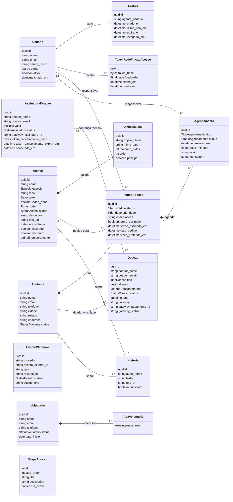
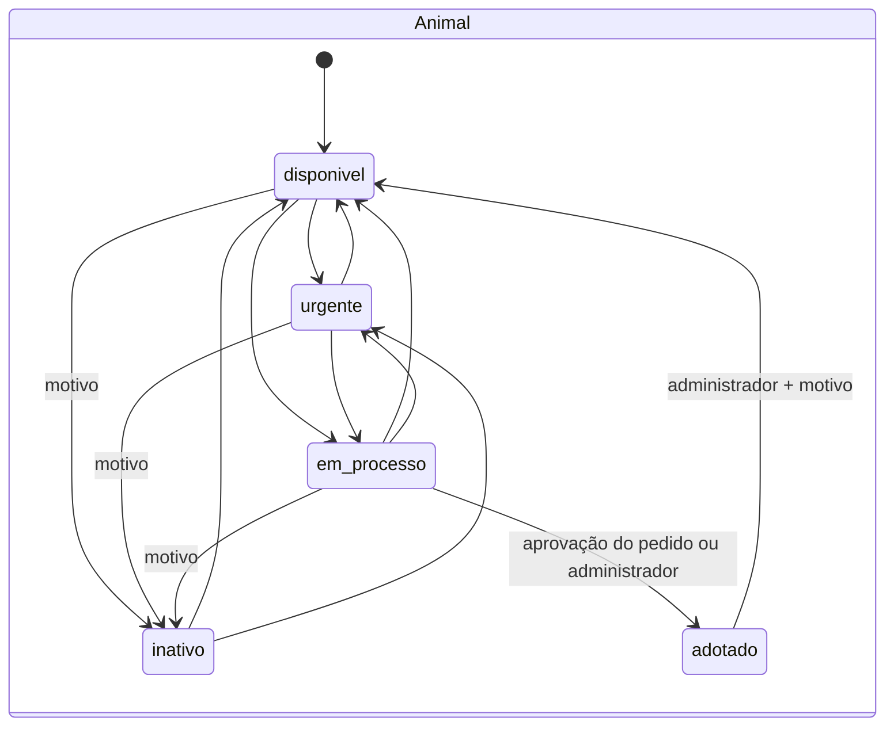
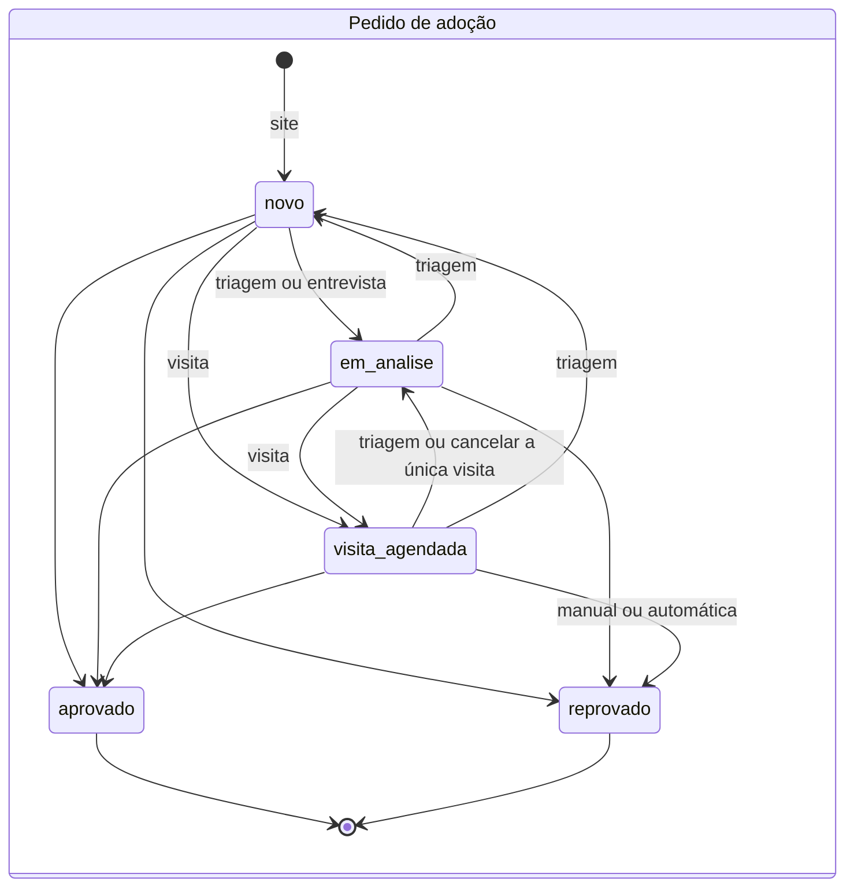

# Diagrama de classes

**Como ler.** O back-end é JavaScript (CommonJS) sem orientação a objetos: a única classe declarada é `AppError`.
Entidades são objetos simples vindos do banco, e services são criados por funções de fábrica
(`createXService(deps)`) que devolvem um objeto com funções. Os diagramas abaixo representam:

1. **Modelo de domínio** — as entidades persistidas como classes conceituais (atributos = colunas, relacionamentos =
   chaves estrangeiras), com os valores fechados como enumerações.
2. **Camada de aplicação** — cada service e repository como uma "classe" cujos métodos são as funções exportadas,
   com as dependências injetadas pela fábrica.

Tipos e restrições de cada atributo: [modelo-er.md](modelo-er.md) e [5. Banco de dados](../05-banco-de-dados.md).

## 1. Modelo de domínio

`*--` (composição) marca as FKs com `ON DELETE CASCADE` em que a parte não existe sem o todo; a ligação
`Animal — PedidoAdocao` é `RESTRICT`. `EventoWebhook` e `EtapaAdocao` não têm relacionamentos no banco. O limite
"0..12" fotos é regra da API (RN06), não do banco.

### Enumerações

```mermaid
classDiagram
  class Cargo {
    <<enumeration>>
    administrador
    gestor_ong
    gestor_animais
    financeiro
    voluntariado
  }
  class StatusAnimal {
    <<enumeration>>
    disponivel
    urgente
    em_processo
    adotado
    inativo
  }
  class StatusPedido {
    <<enumeration>>
    novo
    em_analise
    visita_agendada
    aprovado
    reprovado
  }
  class StatusAdotante {
    <<enumeration>>
    em_analise
    visita_agendada
    adotante
    inativo
  }
  class StatusAgendamento {
    <<enumeration>>
    agendado
    realizado
    cancelado
  }
  class TipoAgendamento {
    <<enumeration>>
    visita
    entrevista
  }
  class StatusDoacao {
    <<enumeration>>
    pendente
    confirmada
    cancelada
    falhou
  }
  class MetodoDoacao {
    <<enumeration>>
    pix
    cartao
    boleto
    transferencia
  }
  class TipoDoacao {
    <<enumeration>>
    unica
    recorrente
  }
  class StatusAssinatura {
    <<enumeration>>
    pendente
    ativa
    pausada
    cancelada
  }
  class StatusEvento {
    <<enumeration>>
    recebido
    processado
    falhou
    ignorado
  }
  class Prioridade {
    <<enumeration>>
    alto
    medio
    baixo
  }
  class Especie {
    <<enumeration>>
    cachorro
    gato
    outro
  }
  class Porte {
    <<enumeration>>
    pequeno
    medio
    grande
  }
  class Sexo {
    <<enumeration>>
    macho
    femea
  }
  class StatusVoluntario {
    <<enumeration>>
    ativo
    inativo
  }
  class Finalidade {
    <<enumeration>>
    redefinicao
    convite
  }
  class AreaInteresse {
    <<enumeration>>
    passeios
    banho_e_tosa
    divulgacao
    eventos
    transporte
    fotografia
    socializacao
    captacao
    manutencao
  }
```

### Máquinas de estado

A aprovação de um pedido leva o animal a `adotado` a partir de qualquer status, exceto `adotado` e `inativo`
(`ANIMAL_JA_ADOTADO`, `ANIMAL_INATIVO`); a reprovação do último pedido aberto devolve `em_processo` para `disponivel`.

Entre os três status abertos a triagem pode mover livremente (`PATCH /adoption-requests/:id`); `aprovado` e
`reprovado` são finais (só aceitam anotações). Doação: `pendente → confirmada/falhou/cancelada` (manual ou webhook);
`cancelada` é final. Assinatura: `pendente ↔ ativa ↔ pausada → cancelada` conforme o Mercado Pago.

## 2. Camada de aplicação

```mermaid
classDiagram
  direction TB

  class AppError {
    +number status
    +string code
    +string message
    +Array details
    +constructor(status, code, message, details)
  }

  class AuthService {
    +login(credenciais, contexto)
    +refresh(refreshToken)
    +logout(refreshToken)
    +getCurrentUser(id)
    +changeOwnPassword(userId, payload, contexto)
    +requestPasswordReset(payload)
    +resetPassword(payload)
  }
  class AccessLinkService {
    +issue(user, finalidade)
    +send(user, finalidade)
    +consume(db, token)
  }
  class LoginThrottle {
    -Map accounts
    +check(email)
    +registerFailure(email)
    +registerSuccess(email)
  }
  class UserService {
    +list(query)
    +getById(id)
    +create(payload, actor)
    +sendInvite(id, actor)
    +update(id, payload, actor)
    +resetPassword(id, payload, actor)
  }
  class AuditService {
    +record(event, db)
    +auditContext(req)$
  }
  class AnimalService {
    +list(query)
    +listPublicPage(query)
    +getPublicById(id)
    +listForExport(query)
    +getById(id)
    +getDetail(id)
    +create(payload, actor)
    +update(id, payload, actor)
    +changeStatus(id, payload, actor)
    +remove(id, actor)
    +addPhotos(id, files, actor)
    +setPrincipalPhoto(id, photoId, actor)
    +removePhoto(id, photoId, actor)
    +listAll(filters)
    +listPublic()
  }
  class AnimalStatusRules {
    +assertStatusTransition(from, to, role, motivo)$
  }
  class AdoptionRequestService {
    +create(payload)
  }
  class AdoptionTriageService {
    +list(query)
    +board(opcoes)
    +getById(id)
    +reveal(id, actor)
    +update(id, payload, actor)
    +approve(id, payload, actor)
    +reject(id, payload, actor)
    +schedule(id, payload, actor)
    +reschedule(id, appointmentId, payload, actor)
    +cancelAppointment(id, appointmentId, payload, actor)
    +completeAppointment(id, appointmentId, actor)
    +markTermSigned(id, actor)
  }
  class AdopterService {
    +list(query)
    +getById(id)
    +reveal(id, actor)
    +update(id, payload, actor)
    +listForExport(query, opcoes, actor)
    +exportTitularData(id, actor)
    +anonymize(id, actor)
    +remove(id, actor)
  }
  class DonationService {
    +list(query)
    +getById(id)
    +create(payload, actor)
    +update(id, payload, actor)
    +summary(query)
    +monthly(query)
    +listForExport(query, actor)
  }
  class OnlineDonationService {
    +isAvailable()
    +startCheckout(payload)
    +getPublicStatus(ref)
    +handleWebhook(request)
    +requestCancelLink(payload)
    +cancelByToken(payload)
    +listSubscriptions(query)
    +cancelSubscriptionById(id, actor)
  }
  class DashboardService {
    -cache
    +summary(opcoes)
    +publicStats()
  }
  class StoryService {
    +list(query)
    +getById(id)
    +create(payload, actor)
    +update(id, payload, actor)
    +remove(id, actor)
    +listPublished(query)
  }
  class VolunteerService {
    +list(query)
    +getById(id)
    +create(payload, actor)
    +update(id, payload, actor)
    +remove(id, actor)
    +apply(payload)
  }
  class AdoptionStepService {
    +listActive()
  }

  class Mailer {
    +isConfigured()
    +send(mensagem)
  }
  class MercadoPagoClient {
    +createPreference(body)
    +getPayment(id)
    +createPreapproval(body)
    +getPreapproval(id)
    +cancelPreapproval(id)
    +getAuthorizedPayment(id)
  }
  class PhotoStorage {
    +string directory
    +save(buffer)
    +remove(key)
    +urlFor(key)
  }

  class Repositories {
    <<module>>
    user · session · access-link
    animal · animal-media
    adoption-request · adoption-triage · appointment
    adopter · donation · online-donation
    story · volunteer · dashboard
    adoption-step · audit
  }

  AuthService --> LoginThrottle
  AuthService --> AccessLinkService
  AuthService --> Repositories : user, session
  AccessLinkService --> Mailer
  AccessLinkService --> Repositories : access-link
  UserService --> AccessLinkService
  UserService --> AuditService
  UserService --> Repositories : user, session
  AnimalService --> AnimalStatusRules
  AnimalService --> PhotoStorage
  AnimalService --> AuditService
  AnimalService --> Repositories : animal, animal-media
  AdoptionRequestService --> Repositories : adoption-request
  AdoptionTriageService --> Mailer
  AdoptionTriageService --> AuditService
  AdoptionTriageService --> Repositories : adoption-triage, appointment
  AdopterService --> AuditService
  AdopterService --> Repositories : adopter
  DonationService --> AuditService
  DonationService --> Repositories : donation
  OnlineDonationService --> MercadoPagoClient
  OnlineDonationService --> Mailer
  OnlineDonationService --> AuditService
  OnlineDonationService --> Repositories : online-donation
  DashboardService --> Repositories : dashboard
  StoryService --> AuditService
  StoryService --> Repositories : story
  VolunteerService --> AuditService
  VolunteerService --> Repositories : volunteer
  AdoptionStepService --> Repositories : adoption-step
  AuditService --> Repositories : audit
  AuthService ..> AppError : lança
  AnimalStatusRules ..> AppError : lança
  MercadoPagoClient ..> AppError : lança
```

Os 12 controllers só traduzem HTTP ↔ service e não aparecem no diagrama (o router `permissions` usa o
`user-controller`, e o de webhooks, o `online-donation-controller`);
o mapeamento rota → controller → service está em [4. Endpoints](../04-endpoints/README.md). Todo service pode
lançar `AppError` (só três setas estão desenhadas). Repositories recebem um cliente `db` opcional para participar da
transação do chamador.
