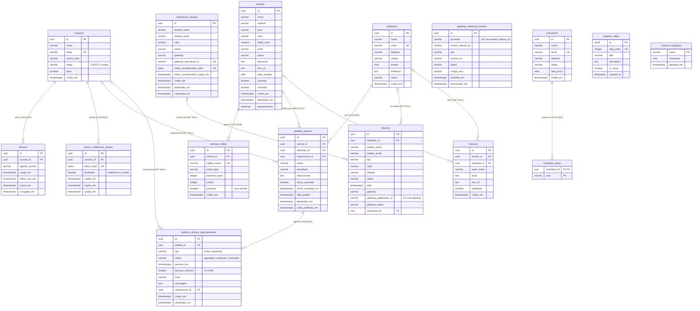

# Modelo entidade-relacionamento

Modelo **físico** do banco atual: migrations aplicadas `000` + `009`–`013` e a tabela `schema_migrations` (16
tabelas). As tabelas das migrations propostas `001`–`008` não entram (lista em
[5. Banco de dados](../05-banco-de-dados.md#propostas-não-aplicadas-fora-de-ordemjson)).

## Diagrama

Notas:

- Os tipos estão simplificados no diagrama (`varchar` sem tamanho; `textArray` = `text[]`). Tamanhos, padrões e
  restrições `CHECK` estão no dicionário abaixo.
- Entre parênteses, a ação da chave estrangeira quando o registro "pai" é apagado.
- `gateway_webhook_eventos`, `adoption_steps` e `schema_migrations` não têm chave estrangeira. O evento de webhook se
  liga à doação/assinatura só logicamente, pelo `recurso_id` no Mercado Pago.
- O índice único parcial `uq_animais_midias_principal` garante no máximo uma foto principal por animal; o
  `uq_doacoes_gateway_pagamento` evita gravar duas vezes o mesmo pagamento do Mercado Pago.

## Views e gatilhos

| Objeto | Lê de | Uso |
| --- | --- | --- |
| `vw_doacoes_por_mes` | `doacoes` (`confirmada`) | Série mensal de doações |
| `vw_kpis_gerais` | `animais`, `pedidos_adocao`, `doacoes` | Indicadores do painel e números públicos |
| `set_atualizado_em()` + 4 gatilhos | — | Mantém `atualizado_em` em `animais`, `pedidos_adocao`, `pedidos_adocao_agendamentos`, `assinaturas_doacao` |

## Dicionário de dados

Cópia do dicionário de [5. Banco de dados](../05-banco-de-dados.md#tabelas) (mantenha os dois iguais; o trecho
original fica entre os marcadores `dicionario:inicio`/`dicionario:fim`).

Legenda: **NN** = obrigatório (`NOT NULL`); PK = chave primária; FK = chave estrangeira; UQ = único.

### `usuarios` — membros da equipe do painel (migration 000; cargo ampliado na 009)

| Campo | Tipo | NN | Padrão | Restrições | Descrição |
| --- | --- | :---: | --- | --- | --- |
| `id` | uuid | sim | `gen_random_uuid()` | PK | Identificador |
| `nome` | varchar(150) | sim | | | Nome completo |
| `email` | varchar(150) | sim | | UQ `usuarios_email_key` | Login (a API grava em minúsculas e busca por `LOWER(email)`) |
| `senha_hash` | varchar(255) | sim | | | Hash bcrypt (12 rodadas) |
| `cargo` | varchar(50) | sim | | CHECK `administrador`, `gestor_ong`, `gestor_animais`, `financeiro`, `voluntariado` | Define as permissões |
| `ativo` | boolean | sim | `true` | | Inativo não entra e perde as sessões |
| `criado_em` | timestamptz | sim | `now()` | | Cadastro |

### `sessoes` — sessões do painel (010)

| Campo | Tipo | NN | Padrão | Restrições | Descrição |
| --- | --- | :---: | --- | --- | --- |
| `id` | uuid | sim | `gen_random_uuid()` | PK | Vai nos tokens como `sid` |
| `usuario_id` | uuid | sim | | FK → `usuarios.id` `ON DELETE CASCADE` | Dono da sessão |
| `agente_usuario` | varchar(500) | não | | | Navegador (user-agent) no login |
| `criado_em` | timestamptz | sim | `now()` | | Login |
| `ultimo_uso_em` | timestamptz | sim | `now()` | | Última renovação |
| `expira_em` | timestamptz | sim | | | Login + `SESSION_MAX_HOURS` |
| `revogado_em` | timestamptz | não | | | Logout, troca de senha ou desativação |

Índice: `idx_sessoes_usuario_ativas (usuario_id) WHERE revogado_em IS NULL`.

### `tokens_redefinicao_acesso` — links de redefinição de senha e convite (010)

| Campo | Tipo | NN | Padrão | Restrições | Descrição |
| --- | --- | :---: | --- | --- | --- |
| `id` | uuid | sim | `gen_random_uuid()` | PK | |
| `usuario_id` | uuid | sim | | FK → `usuarios.id` `ON DELETE CASCADE` | |
| `token_hash` | bytea | sim | | UQ | SHA-256 do token (o token só existe no e-mail) |
| `finalidade` | varchar(20) | sim | | CHECK `redefinicao`, `convite` | Validade: 1 h e 72 h |
| `criado_em` | timestamptz | sim | `now()` | | |
| `expira_em` | timestamptz | sim | | | |
| `usado_em` | timestamptz | não | | | Preenchido no uso ou quando um novo link é gerado |

Índice: `idx_tokens_redefinicao_pendentes (usuario_id) WHERE usado_em IS NULL`.

### `animais` — animais sob cuidado da ONG (000; `temperamento` na 012)

| Campo | Tipo | NN | Padrão | Restrições | Descrição |
| --- | --- | :---: | --- | --- | --- |
| `id` | uuid | sim | `gen_random_uuid()` | PK | |
| `nome` | varchar(100) | sim | | | |
| `especie` | varchar(30) | sim | | CHECK `cachorro`, `gato`, `outro` | |
| `raca` | varchar(100) | não | | | |
| `sexo` | varchar(10) | não | | CHECK `macho`, `femea` | |
| `idade_anos` | numeric(4,1) | não | | | Idade estimada em anos (0–999,9) |
| `porte` | varchar(20) | não | | CHECK `pequeno`, `medio`, `grande` | |
| `status` | varchar(20) | sim | `'disponivel'` | CHECK `disponivel`, `em_processo`, `adotado`, `urgente`, `inativo` | Só `disponivel`/`urgente` aparecem no site |
| `descricao` | text | não | | | |
| `foto_url` | text | não | | | URL da foto principal |
| `data_entrada` | date | sim | `CURRENT_DATE` | | Chegada à ONG |
| `castrado` | boolean | sim | `false` | | |
| `vacinado` | boolean | sim | `false` | | |
| `criado_em` | timestamptz | sim | `now()` | | |
| `atualizado_em` | timestamptz | sim | `now()` | gatilho `trg_animais_atualizado` | |
| `temperamento` | text[] | sim | `'{}'` | | Traços (até 10 de 40 caracteres, regra da API) |

Índices: `idx_animais_especie (especie)`, `idx_animais_status (status)`.

### `animais_midias` — galeria de fotos (012)

| Campo | Tipo | NN | Padrão | Restrições | Descrição |
| --- | --- | :---: | --- | --- | --- |
| `id` | uuid | sim | `gen_random_uuid()` | PK | |
| `animal_id` | uuid | sim | | FK → `animais.id` `ON DELETE CASCADE` | |
| `objeto_chave` | varchar(200) | sim | | UQ | Nome do arquivo em `UPLOAD_DIR/animais/` (`<uuid>.<ext>`) |
| `mime_type` | varchar(50) | sim | | CHECK `image/jpeg`, `image/png`, `image/webp` | Detectado pelo conteúdo |
| `tamanho_bytes` | integer | sim | | CHECK > 0 | |
| `ordem` | integer | sim | `0` | CHECK ≥ 0 | A API usa `MAX(ordem)+1` |
| `principal` | boolean | sim | `false` | UQ parcial: 1 por animal | Define o `foto_url` |
| `criado_em` | timestamptz | sim | `now()` | | |

Índices: `idx_animais_midias_animal (animal_id, ordem)`; `uq_animais_midias_principal (animal_id) WHERE principal`.

### `adotantes` — interessados em adotar (000)

| Campo | Tipo | NN | Padrão | Restrições | Descrição |
| --- | --- | :---: | --- | --- | --- |
| `id` | uuid | sim | `gen_random_uuid()` | PK | |
| `nome` | varchar(150) | sim | | | |
| `email` | varchar(150) | sim | | UQ `adotantes_email_key` | Identifica o adotante nos pedidos do site |
| `telefone` | varchar(20) | não | | | Dado pessoal (mascarado na API) |
| `cidade` | varchar(100) | não | | | |
| `estado` | char(2) | não | | | UF |
| `endereco` | text | não | | | Dado pessoal (omitido na API) |
| `status` | varchar(20) | sim | `'em_analise'` | CHECK `em_analise`, `visita_agendada`, `adotante`, `inativo` | Atualizado pela triagem |
| `criado_em` | timestamptz | sim | `now()` | | |

Índice: `idx_adotantes_status (status)`.

### `pedidos_adocao` — pedidos de adoção (000; `visita_preferida_em` na 011)

| Campo | Tipo | NN | Padrão | Restrições | Descrição |
| --- | --- | :---: | --- | --- | --- |
| `id` | uuid | sim | `gen_random_uuid()` | PK | Protocolo = `PAC-` + 8 primeiros caracteres |
| `animal_id` | uuid | sim | | FK → `animais.id` `ON DELETE RESTRICT` | |
| `adotante_id` | uuid | sim | | FK → `adotantes.id` `ON DELETE CASCADE` | |
| `responsavel_id` | uuid | não | | FK → `usuarios.id` `ON DELETE SET NULL` | Membro responsável pela triagem |
| `status` | varchar(20) | sim | `'novo'` | CHECK `novo`, `em_analise`, `visita_agendada`, `aprovado`, `reprovado` | Abertos: os três primeiros |
| `prioridade` | varchar(10) | **não** | `'medio'` | CHECK `alto`, `medio`, `baixo` | |
| `observacoes` | text | não | | | Dados do formulário + histórico de anotações |
| `termo_assinado` | boolean | sim | `false` | | |
| `termo_assinado_em` | timestamptz | não | | | |
| `data_pedido` | timestamptz | sim | `now()` | | |
| `atualizado_em` | timestamptz | sim | `now()` | gatilho `trg_pedidos_atualizado` | Usado como data aproximada da aprovação no dashboard |
| `visita_preferida_em` | timestamptz | não | | | Sugestão do adotante |

Índices: `idx_pedidos_adotante (adotante_id)`, `idx_pedidos_animal (animal_id)`, `idx_pedidos_status (status)`.

### `pedidos_adocao_agendamentos` — visitas e entrevistas (011)

| Campo | Tipo | NN | Padrão | Restrições | Descrição |
| --- | --- | :---: | --- | --- | --- |
| `id` | uuid | sim | `gen_random_uuid()` | PK | |
| `pedido_id` | uuid | sim | | FK → `pedidos_adocao.id` `ON DELETE CASCADE` | |
| `tipo` | varchar(20) | sim | | CHECK `visita`, `entrevista` | |
| `status` | varchar(20) | sim | `'agendado'` | CHECK `agendado`, `realizado`, `cancelado` | |
| `previsto_em` | timestamptz | sim | | | Início |
| `duracao_minutos` | smallint | sim | `60` | CHECK 15–480 | |
| `local` | varchar(300) | não | | | Local ou link |
| `mensagem` | text | não | | | Mensagem ao adotante |
| `responsavel_id` | uuid | não | | FK → `usuarios.id` `ON DELETE SET NULL` | Base da verificação de conflito |
| `criado_em` | timestamptz | sim | `now()` | | |
| `atualizado_em` | timestamptz | sim | `now()` | gatilho `trg_agendamentos_atualizado` | |

Índices: `idx_agendamentos_pedido (pedido_id)`; `idx_agendamentos_ativos (previsto_em) WHERE status = 'agendado'`.

### `doacoes` — doações manuais e online (000; colunas de gateway e status `falhou` na 013)

| Campo | Tipo | NN | Padrão | Restrições | Descrição |
| --- | --- | :---: | --- | --- | --- |
| `id` | uuid | sim | `gen_random_uuid()` | PK | Referência pública da doação online |
| `adotante_id` | uuid | não | | FK → `adotantes.id` `ON DELETE SET NULL` | |
| `doador_nome` | varchar(150) | sim | | | |
| `doador_email` | varchar(150) | não | | | Mascarado nas listas |
| `tipo` | varchar(20) | sim | | CHECK `unica`, `recorrente` | |
| `valor` | numeric(10,2) | sim | | CHECK > 0 | |
| `metodo` | varchar(30) | não | | CHECK `pix`, `cartao`, `boleto`, `transferencia` | |
| `status` | varchar(20) | sim | `'confirmada'` | CHECK `pendente`, `confirmada`, `cancelada`, `falhou` | Online nasce `pendente` |
| `data` | timestamptz | sim | `now()` | | |
| `gateway` | varchar(30) | não | | | `mercado_pago` nas online (bloqueia edição manual) |
| `gateway_pagamento_id` | varchar(100) | não | | UQ parcial com `gateway` | Id do pagamento no MP |
| `gateway_status` | varchar(40) | não | | | Status cru do MP |
| `assinatura_id` | uuid | não | | FK → `assinaturas_doacao.id` `ON DELETE SET NULL` | Cobrança de doação mensal |

Índices: `idx_doacoes_data (data)`, `idx_doacoes_tipo (tipo)`,
`uq_doacoes_gateway_pagamento (gateway, gateway_pagamento_id) WHERE gateway_pagamento_id IS NOT NULL`.

### `assinaturas_doacao` — doações mensais (013)

| Campo | Tipo | NN | Padrão | Restrições | Descrição |
| --- | --- | :---: | --- | --- | --- |
| `id` | uuid | sim | `gen_random_uuid()` | PK | `external_reference` no MP |
| `doador_nome` | varchar(150) | sim | | | |
| `doador_email` | varchar(150) | sim | | | |
| `valor` | numeric(10,2) | sim | | CHECK > 0 | Valor mensal |
| `status` | varchar(20) | sim | `'pendente'` | CHECK `pendente`, `ativa`, `pausada`, `cancelada` | |
| `gateway` | varchar(30) | sim | `'mercado_pago'` | | |
| `gateway_assinatura_id` | varchar(100) | não | | UQ | Id da preapproval |
| `token_cancelamento_hash` | bytea | não | | UQ | SHA-256 do link de cancelamento |
| `token_cancelamento_expira_em` | timestamptz | não | | | 7 dias |
| `criado_em` | timestamptz | sim | `now()` | | |
| `atualizado_em` | timestamptz | sim | `now()` | gatilho `trg_assinaturas_doacao_atualizado` | |
| `cancelada_em` | timestamptz | não | | | |

Índice: `idx_assinaturas_doacao_email (lower(doador_email))`.

### `gateway_webhook_eventos` — notificações recebidas (013)

| Campo | Tipo | NN | Padrão | Restrições | Descrição |
| --- | --- | :---: | --- | --- | --- |
| `id` | uuid | sim | `gen_random_uuid()` | PK | |
| `provedor` | varchar(30) | sim | | UQ com `evento_externo_id` | `mercado_pago` |
| `evento_externo_id` | varchar(200) | sim | | | Id da notificação (idempotência) |
| `tipo` | varchar(60) | sim | | | `payment`, `subscription_preapproval`, … |
| `recurso_id` | varchar(100) | sim | | | Id do recurso no MP |
| `status` | varchar(20) | sim | `'recebido'` | CHECK `recebido`, `processado`, `falhou`, `ignorado` | |
| `codigo_erro` | varchar(80) | não | | | |
| `recebido_em` | timestamptz | sim | `now()` | | |
| `processado_em` | timestamptz | não | | | |

O corpo da notificação **não** é guardado.

### `historias` — histórias de adoção (000)

| Campo | Tipo | NN | Padrão | Restrições | Descrição |
| --- | --- | :---: | --- | --- | --- |
| `id` | uuid | sim | `gen_random_uuid()` | PK | |
| `animal_id` | uuid | não | | FK → `animais.id` `ON DELETE SET NULL` | |
| `adotante_id` | uuid | não | | FK → `adotantes.id` `ON DELETE SET NULL` | Nunca exposto no site |
| `autor_nome` | varchar(150) | sim | | | |
| `texto` | text | sim | | | 10–5000 (regra da API) |
| `foto_url` | text | não | | | |
| `publicado` | boolean | sim | `false` | | Só publicadas aparecem no site |
| `criado_em` | timestamptz | sim | `now()` | | |

### `voluntarios` — voluntários (000)

| Campo | Tipo | NN | Padrão | Restrições | Descrição |
| --- | --- | :---: | --- | --- | --- |
| `id` | uuid | sim | `gen_random_uuid()` | PK | Protocolo = `VOL-` + 8 primeiros caracteres |
| `nome` | varchar(150) | sim | | | |
| `email` | varchar(150) | sim | | UQ `voluntarios_email_key` | |
| `telefone` | varchar(20) | não | | | |
| `status` | varchar(20) | sim | `'ativo'` | CHECK `ativo`, `inativo` | Inscrição pelo site entra `inativo` |
| `data_inicio` | date | sim | `CURRENT_DATE` | | |
| `criado_em` | timestamptz | sim | `now()` | | |

### `voluntario_areas` — áreas de interesse do voluntário (000)

| Campo | Tipo | NN | Padrão | Restrições | Descrição |
| --- | --- | :---: | --- | --- | --- |
| `voluntario_id` | uuid | sim (PK) | | PK composta; FK → `voluntarios.id` `ON DELETE CASCADE` | |
| `area` | varchar(50) | sim (PK) | | PK composta; CHECK `passeios`, `banho_e_tosa`, `divulgacao`, `eventos`, `transporte`, `fotografia`, `socializacao`, `captacao`, `manutencao` | |

### `adoption_steps` — etapas do processo de adoção exibidas no site (000)

| Campo | Tipo | NN | Padrão | Restrições | Descrição |
| --- | --- | :---: | --- | --- | --- |
| `id` | serial | sim | sequência | PK | |
| `step_order` | integer | sim | | UQ `adoption_steps_step_order_key` | Ordem (sai como `ordem`) |
| `title` | varchar(100) | sim | | | Sai como `titulo` |
| `description` | text | sim | | | Sai como `descricao` |
| `is_active` | boolean | não | `true` | | `false` esconde do site |
| `created_at` | timestamp (sem fuso) | não | `CURRENT_TIMESTAMP` | | |

Única tabela com nomes em inglês e sem endpoint de escrita.

### `schema_migrations` — controle de migrations (criada por `scripts/migrar.js`)

| Campo | Tipo | NN | Padrão | Restrições | Descrição |
| --- | --- | :---: | --- | --- | --- |
| `nome` | varchar(200) | sim | | PK | Arquivo de `migrations/` |
| `checksum` | char(64) | sim | | | SHA-256 do arquivo aplicado |
| `aplicada_em` | timestamptz | sim | `now()` | | |
